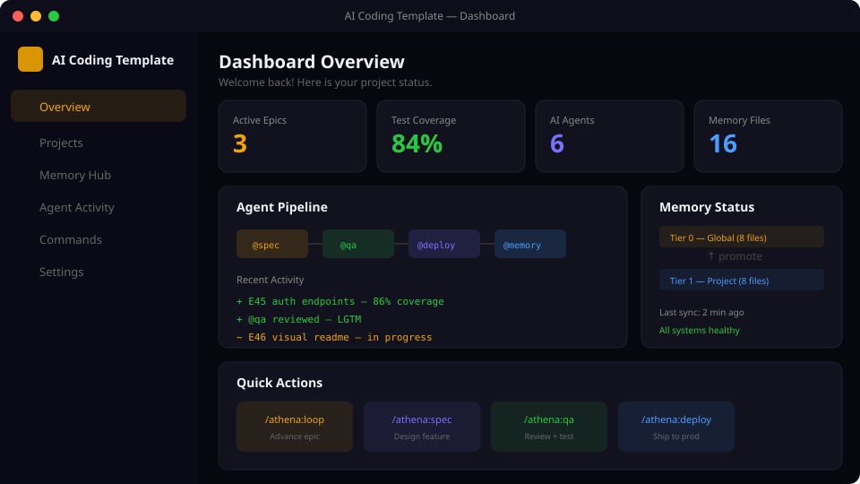

# AI Coding Template (Next.js)

[](https://github.com/cloud-f1/ai-coding-nexjs-template/actions/workflows/ci.yml)
[](LICENSE)
[](https://nextjs.org)
[](https://ai-coding-nexjs-template-docs.pages.dev/)

[](https://www.skool.com/ai-brain-alex/about?ref=5dde9b20e8e7432aa9a01df6e89685f4)
[](https://github.com/cloud-f1/ai-coding-nexjs-template/stargazers)

一套即開即用的 **Next.js SaaS 起手式**。內建認證、3 階 RBAC、深色主題、繁體中文 i18n、測試框架 — 並支援 **AI-Ready 模組化金流/落地頁**（透過 shadcn `@saas` registry 自由安裝/拆卸）。搭配 Claude Code 可解鎖 AI Agent 團隊自動開發（含並行管線），不用也能當獨立 SaaS 模板使用。

A production-ready **Next.js SaaS starter**. Built-in auth, 3-tier RBAC, dark theming, 繁中 i18n, and tests — plus an **AI-Ready modular billing/landing system** you install or remove via a shadcn `@saas` registry. Optionally unlock an AI agent team with a parallel pipeline via Claude Code.

繁體中文 | [English](#english)

<p align="center">
  
</p>

> 📚 **線上文件 / Live docs:** <https://ai-coding-nexjs-template-docs.pages.dev/> — 模組目錄、API 參考、白皮書、demo gallery。

---

## 快速開始

```bash
git clone https://github.com/cloud-f1/ai-coding-nexjs-template.git && cd ai-coding-nexjs-template
docker compose up --build -d        # 啟動 postgres + 遷移/seed + web（含 mailpit）
open http://localhost:3000           # mailpit 信箱在 :8025
```

Demo 登入（seed 帳號）：

| 角色 | 帳號 | 密碼 |
|------|------|------|
| admin | `admin@example.com` | `Admin123!` |
| editor | `editor@example.com` | `Editor123!` |
| viewer | `viewer@example.com` | `Viewer123!` |

> 想本機跑而不用 Docker？進 `next-app/`，設定 `DATABASE_URL` + `AUTH_SECRET`，然後 `pnpm install && pnpm db:migrate && pnpm db:seed && pnpm dev`。

---

## 技術棧

**Next.js 16 (App Router) + React 19 + TypeScript + Tailwind CSS v4 + shadcn/ui + Drizzle ORM (Postgres) + Auth.js v5 (JWT sessions)**

<details>
<summary><b>認證 & 授權</b> — Auth.js v5 (NextAuth) + 3 階 RBAC</summary>

- Credentials（bcrypt）+ Google OAuth，**JWT session 策略**（Credentials + DrizzleAdapter 必須用 JWT）
- 3 階角色：`admin / editor / viewer`（migration 0003），RBAC guard **從 DB 重讀角色**
- Email 驗證 token、忘記/重設密碼、登入限流

</details>

<details>
<summary><b>前端</b> — Server Components 優先 + shadcn/ui</summary>

- 預設 Server Component，僅在需要瀏覽器 API/事件/state 時加 `"use client"`
- shadcn/ui（`components/ui/`，blue preset）+ Tailwind `dark:` 主題切換（next-themes）
- 完整 **繁體中文 i18n**（UI、Zod 訊息、Server Action 錯誤、metadata）

</details>

<details>
<summary><b>AI-Ready 模組化（核心特色）</b> — shadcn <code>@saas</code> registry</summary>

- 用 `npx shadcn add @saas/<module>` 安裝**整個功能模組**（含 server actions、db schema、routes、env 需求），不只 UI 元件
- 內建模組：`billing-stripe`（**預設金流**）、`billing-ecpay`（綠界定期定額）、`landing`（落地頁）、`hello-module`（smoke）
- `PaymentProvider` 抽象層（env 選擇 provider，預設 stripe）+ Drizzle `plans/subscriptions/payment_events`（冪等）
- 每個模組附 `module.manifest.json`（機器可讀 env/db/route/相依），`module-author` skill 可讓 AI 自動生成模組；`.mcp.json` 讓 AI agent 讀 registry 後以自然語言安裝模組

</details>

<details>
<summary><b>開發工具鏈</b> — 測試 / 型別 / 品質閘</summary>

- Vitest 單元測試 + Playwright e2e（`pnpm test` / `pnpm test:e2e`）
- `pnpm typecheck` + `pnpm lint`（eslint-config-next）+ `pnpm registry:build` + `pnpm module:validate`
- `make smoke` 一鍵冒煙（typecheck + lint + unit + build + e2e + registry install）
- `scripts/pre-merge-check.sh` 合併前品質閘

</details>

---

## 模組化 `@saas` registry

```bash
# 在你的 next-app 專案，components.json 設定 @saas registry 後：
npx shadcn add @saas/billing-stripe   # 安裝 Stripe 金流（Checkout + webhook 驗簽 + 冪等）
npx shadcn add @saas/billing-ecpay    # 綠界定期定額（CheckMacValue + dual notify route handlers）
npx shadcn add @saas/landing          # 落地頁（hero/features/pricing/FAQ/CTA）
```

維護端：`pnpm registry:build`（`registry.json` → `public/r/*.json`）、`pnpm module:validate`（驗證 manifest）。
作者指南見 `module-author` skill 與 [線上文件的模組目錄](https://ai-coding-nexjs-template-docs.pages.dev/modules/)。

---

## 有沒有 Claude Code 都能用

| | 不使用 Claude Code | 搭配 Claude Code |
|---|---|---|
| **SaaS 模板** | 完整 Next.js 起手式、認證、RBAC、主題、模組化金流 | 相同 |
| **開發方式** | 手動寫 code、手動跑測試 | AI Agent 團隊自動化開發 |
| **指令系統** | 不適用 | Athena 指令命名空間（含並行批次 `/athena:batch`、`/athena:flow`） |
| **品質把關** | 手動 review + 測試 | @qa / @reviewer Agent + stop-verifier hooks |
| **觀測性** | 不適用 | Webhook 通知 + JSONL 審計日誌 |

---

## 給 Track B 模組包學員

如果你從 Alex 的 [Claude Agentic Coding 模組包](https://www.skool.com/ai-brain-alex/about?ref=5dde9b20e8e7432aa9a01df6e89685f4) 來——歡迎。本 repo 是 **Track B B2 (Project Bootstrap)** 模組的核心 reference codebase。

### Fork 後 30 分鐘上手

繁中 fork 導讀見 [`docs/zh-tw/getting-started.md`](docs/zh-tw/getting-started.md)。摘要：

1. `gh repo fork cloud-f1/ai-coding-nexjs-template my-project`
2. `make local-setup`（裝依賴 + Docker 起 Postgres/Mailpit + migrate + seed）→ `make local` → http://localhost:3000，用 demo 帳號登入
3. 客製 `CLAUDE.md`（你的 stack + Architecture Invariants，見其中「Fork 後客製化」段）+ 換品牌 + 從 `.env.example` 設環境變數
4. 跑第一個 epic：`/athena:plan` → `/athena:loop`（品質閘走 `/athena:qa`）

**維護中的權威深入指南**（en + 繁中，跟 code 同步）在 [`docs/guides/`](docs/guides/)——建議從 [quickstart](docs/guides/zh-TW/quickstart.md) + [第一個 epic walkthrough](docs/guides/zh-TW/first-epic-walkthrough.md) 開始。Track B 5 模組對應導讀：[`docs/zh-tw/track-b-integration.md`](docs/zh-tw/track-b-integration.md)。

### 不是 Track B 學員也歡迎用

本 repo 完整功能 free + MIT 授權 + 可商用。Track B 學員只是有額外的學習路徑（課程 + 陪跑），不影響本 repo 自身價值。

---

## AI Agent 團隊（搭配 Claude Code）

12 個 agent + Athena 指令命名空間。

```bash
/athena:loop              # 序列：一次推進一個 epic step
/athena:batch auto        # 並行：自動偵測 Phase，分波次派遣 worktree agent
/athena:flow              # 原生 Workflow epic dispatcher（spec→implement→qa→commit）
/loop 2m /athena:batch auto   # 並行自動駕駛（推薦）
```

**並行原理**：解析依賴圖 → 拓撲排序 → 分波次派遣 worktree agent → 波次間整合。每個 epic 依複雜度分配模型（sonnet baseline、opus for complex/ultra）。

```bash
jq 'select(.exit != 0)' .claude/audit.jsonl      # 失敗命令
./scripts/epic-graph.sh --phase 25 --classify     # 波次 + 層級
```

---

## 部署

- **App**：Zeabur — `next-app/` 作為單一 service（`zbpack.json`）。`NEXT_PUBLIC_*` 於 **build 時**注入。
- **Dev docs**：VitePress → Cloudflare Pages（live：<https://ai-coding-nexjs-template-docs.pages.dev/>）。

---

## 文件導覽

| 文件 | 說明 |
|------|------|
| [線上 Dev Docs](https://ai-coding-nexjs-template-docs.pages.dev/) | 模組目錄、API 參考、白皮書、demo |
| [CHANGELOG.md](CHANGELOG.md) | 版本變更紀錄（SemVer + Keep a Changelog） |
| [CLAUDE.md](CLAUDE.md) | 專案身份、架構規則、Athena 指令總表 |
| [TECHSTACK.md](TECHSTACK.md) | 完整技術架構文件 |
| [Epic 進度](docs/epics/EPIC_INDEX.md) | 所有 Epic 的開發進度追蹤 |
| [Agent 代理](docs/reference/agents.md) ｜ [Athena 指令](docs/reference/commands.md) ｜ [技能](docs/reference/skills.md) | AI Agent 團隊參考 |
| [快速上手（fork 流程）](docs/zh-tw/getting-started.md) | Track B 學員 / 新 fork 者 30 分鐘導讀 |
| [深入指南 `docs/guides/`](docs/guides/) — [quickstart](docs/guides/zh-TW/quickstart.md) ｜ [第一個 epic walkthrough](docs/guides/zh-TW/first-epic-walkthrough.md) | 維護中、與 code 同步的權威指南（en + 繁中） |

---

## 貢獻

歡迎貢獻！請參閱 [CONTRIBUTING.md](CONTRIBUTING.md) 了解分支策略、Conventional Commits 慣例、SemVer 與 PR 流程。

## 授權

[MIT License](LICENSE) - Copyright (c) 2026 cloud-f1

---

## English

A production-ready **Next.js SaaS starter kit**. Built-in authentication, 3-tier RBAC, dark theming, 繁中 i18n, and a test framework — plus an **AI-Ready modular billing/landing system** distributed through a shadcn `@saas` registry so features can be installed or removed cleanly. Optionally pair with Claude Code to unlock an AI agent team with a parallel pipeline.

### Quick Start

**Start here** — clone, do the one-time local setup (installs deps + a Dockerized Postgres/Mailpit + migrate + seed), then run the dev server:

```bash
git clone https://github.com/cloud-f1/ai-coding-nexjs-template.git && cd ai-coding-nexjs-template
make local-setup                     # first time: install deps + Docker Postgres/Mailpit + migrate + seed
make local                           # run Next.js dev server → http://localhost:3000 (Mailpit inbox on :8025)
```

Demo logins (seeded): `admin@example.com / Admin123!` · `editor@example.com / Editor123!` · `viewer@example.com / Viewer123!`.

> One-shot alternative (everything in Docker, no local dev server): `docker compose up --build -d` → http://localhost:3000.
>
> Prefer running fully without Docker? In `next-app/`, set `DATABASE_URL` + `AUTH_SECRET`, then `pnpm install && pnpm db:migrate && pnpm db:seed && pnpm dev`.

Next steps live in the maintained, code-synced guides under [`docs/guides/`](docs/guides/) — start with [quickstart](docs/guides/en/quickstart.md) and the [first-epic walkthrough](docs/guides/en/first-epic-walkthrough.md).

### Tech Stack

**Next.js 16 (App Router) + React 19 + TypeScript + Tailwind CSS v4 + shadcn/ui + Drizzle ORM (Postgres) + Auth.js v5 (JWT sessions)**

- **Auth & RBAC** — Auth.js v5 (Credentials + Google OAuth), JWT sessions, 3-tier roles (admin/editor/viewer) with guards that re-read the role from the DB.
- **Frontend** — Server Components by default; shadcn/ui (blue preset) with `dark:` theming; full 繁中 i18n.
- **AI-Ready modules (headline feature)** — install whole features (server actions + db schema + routes + env) via `npx shadcn add @saas/<module>`: `billing-stripe` (**default**), `billing-ecpay` (Taiwan 定期定額), `landing`, `hello-module`. A `PaymentProvider` abstraction (env-selected, default stripe) + idempotent `plans/subscriptions/payment_events`. Each module ships a machine-readable `module.manifest.json`; `.mcp.json` lets an AI agent read the registry and install a module by natural language.
- **Toolchain** — Vitest + Playwright, `pnpm typecheck/lint`, `pnpm registry:build` + `pnpm module:validate`, `make smoke`, `scripts/pre-merge-check.sh`.

### Modular `@saas` registry

```bash
npx shadcn add @saas/billing-stripe   # Stripe Checkout + signed webhook + idempotent events
npx shadcn add @saas/billing-ecpay    # ECPay 定期定額 (CheckMacValue + dual notify route handlers)
npx shadcn add @saas/landing          # Marketing landing (hero/features/pricing/FAQ/CTA)
```

Maintainer side: `pnpm registry:build` (`registry.json` → `public/r/*.json`), `pnpm module:validate`. See the [module catalog](https://ai-coding-nexjs-template-docs.pages.dev/modules/).

### With or Without Claude Code

| | Without Claude Code | With Claude Code |
|---|---|---|
| **SaaS Template** | Full Next.js starter, auth, RBAC, themes, modular billing | Same |
| **Development** | Write code and run tests manually | AI agent team automates the workflow |
| **Commands** | N/A | Athena command namespace (`/athena:batch`, `/athena:flow`, parallel) |
| **Quality** | Manual review + testing | @qa / @reviewer agents + stop-verifier hooks |
| **Observability** | N/A | Webhook notifications + JSONL audit log |

### AI Agent Team (with Claude Code)

```bash
/athena:loop              # serial: advance one epic step
/athena:batch auto        # parallel: auto-detect phase, dispatch worktree agents in waves
/athena:flow              # native Workflow epic dispatcher (spec→implement→qa→commit)
/loop 2m /athena:batch auto   # parallel auto-pilot (recommended)
```

Parallelism: dependency graph → topological waves → worktree agents → integrate between waves. Per-epic model tiering (sonnet baseline, opus for complex/ultra).

### Deploy

- **App** — Zeabur, `next-app/` as a single service (`zbpack.json`); `NEXT_PUBLIC_*` baked at build time.
- **Dev docs** — VitePress → Cloudflare Pages (live: <https://ai-coding-nexjs-template-docs.pages.dev/>).

### Documentation

| Document | Description |
|----------|-------------|
| [Live Dev Docs](https://ai-coding-nexjs-template-docs.pages.dev/) | Module catalog, API reference, whitepaper, demos |
| [CHANGELOG.md](CHANGELOG.md) | Version history (SemVer + Keep a Changelog) |
| [CLAUDE.md](CLAUDE.md) | Project identity, architecture rules, Athena commands |
| [TECHSTACK.md](TECHSTACK.md) | Full technical architecture |
| [Epic Progress](docs/epics/EPIC_INDEX.md) | Development progress tracking |
| [Agents](docs/reference/agents.md) · [Commands](docs/reference/commands.md) · [Skills](docs/reference/skills.md) | AI agent team reference |

### Contributing

Contributions welcome! See [CONTRIBUTING.md](CONTRIBUTING.md) for branch strategy, Conventional Commits, SemVer, and PR flow.

### License

[MIT License](LICENSE) - Copyright (c) 2026 cloud-f1
