# Payments Service — Real Import-Graph Map

> **Note (E320):** this file is **illustrative** — a hand-written narrative snapshot, drawn once
> and not regenerated. The **generated source of truth** is
> [`docs/architecture/service-map.md`](service-map.md), produced mechanically by
> `node scripts/service-map.cjs items billing api-keys auth --out docs/architecture/service-map.md`.
> Re-run that command to refresh the real import graph; keep this narrative for the prose
> walkthrough of the billing domain, but trust the generated file for current edges/orphans.

> **This map is drawn from the code, not a whiteboard.** Every edge below was extracted
> from actual `import … from` statements in `next-app/` (tests + the `registry/` distribution
> copies excluded). Regenerate the raw edges with:
>
> ```bash
> cd next-app && grep -rhoE "from ['\"](@/[^'\"]+|\.{1,2}/[^'\"]+)['\"]" \
>   lib/billing lib/usage-utils.ts lib/db/queries/usage.ts actions/billing.ts actions/usage.ts \
>   app/api/billing components/marketing/pricing.tsx \
>   "app/(dashboard)/dashboard/system/_billing-panel.tsx" | grep -v '\.test\.' | sort -u
> ```
>
> Last drawn: 2026-06-19 (migrations through 0010; billing tables in `lib/schema/billing.ts`).

## What the service is

A **provider-abstracted subscription/billing service**. One interface (`PaymentProvider`)
is implemented by two gateways — **Stripe** (default) and **綠界 ECPay 定期定額** — and selected
at runtime by `BILLING_PROVIDER`. Callers (Server Actions, the dashboard billing panel, the
landing pricing table, and webhook/cron HTTP routes) never touch a concrete gateway; they go
through the interface + a single resolver seam. Usage metering hangs off the same pricing config.

## The dependency story in one paragraph (what the graph shows)

`lib/billing/provider.ts` is the **architectural hub**: it defines the `PaymentProvider`
interface + the `Plan`/`Subscription` domain types, and **imports nothing internal**. Everything
points *at* it — the two providers, the resolver, pricing, billing-utils, reconcile-utils — and
nothing it declares points back at a concrete gateway. That's textbook dependency inversion, and
the import graph proves it (no edge from `provider.ts` outward; many edges inward).
`lib/billing/resolver.ts` is the **only** module that maps `BILLING_PROVIDER` → a concrete
provider — the single swap point. The ECPay subtree is larger than Stripe's (it owns `return` +
`period` + `renew` routes) because 定期定額 has **no true auto-renew**, so a `CRON_SECRET`-gated
renewal scanner is ECPay-specific. Finally, `lib/usage-utils.ts → lib/billing/pricing` is the
seam where **usage limits are read from the pricing tiers** (the E308 wiring) — usage and billing
are coupled only through `pricing.ts` + `config/pricing.json`.

## Layered import graph (real edges)

```mermaid
graph TD
  subgraph entry["Entry points (outside the service call in)"]
    LP["app/page.tsx (landing)"]
    SYS["app/(dashboard)/dashboard/system/page.tsx"]
    R_STRIPE["api/billing/stripe/webhook"]
    R_ECRET["api/billing/ecpay/return"]
    R_ECPER["api/billing/ecpay/period"]
    R_ECREN["api/billing/ecpay/renew (cron)"]
    R_REC["api/billing/reconcile"]
  end

  subgraph ui["UI"]
    PRICING["components/marketing/pricing.tsx"]
    PANEL["_billing-panel.tsx"]
    MANAGE["_manage-billing-button.tsx"]
    CANCEL["_cancel-subscription-button.tsx"]
  end

  subgraph actions["Server Actions"]
    ABILL["actions/billing.ts<br/>createCheckoutSession · cancelSubscription · createPortalSession"]
    AUSE["actions/usage.ts<br/>recordUsage"]
  end

  subgraph core["Service core — lib/billing/"]
    PROV["provider.ts<br/>PaymentProvider interface + types (HUB)"]
    RESOLVE["resolver.ts<br/>BILLING_PROVIDER → provider"]
    PSTRIPE["providers/stripe.ts"]
    PECPAY["providers/ecpay.ts"]
    PRICE["pricing.ts"]
    PLANS["plans.ts"]
    PLANRES["plan-resolver-utils.ts"]
    QUERIES["queries.ts"]
    BUTIL["billing-utils.ts"]
    PERIOD["period-utils.ts (pure)"]
    IDEM["idempotency-utils.ts (pure)"]
    PORTAL["portal-utils.ts (pure)"]
    RECON["reconcile-utils.ts"]
  end

  subgraph data["Data + cross-cutting"]
    SCHEMA["lib/schema/billing.ts (Drizzle tables)"]
    DB["lib/db (drizzle client)"]
    UUTIL["lib/usage-utils.ts"]
    UQUERY["lib/db/queries/usage.ts"]
    PRICEJSON["config/pricing.json"]
    PERM["lib/permissions"]
    AUDIT["lib/audit"]
  end

  subgraph ext["External"]
    STRIPESDK["stripe SDK"]
    CRYPTO["crypto (HMAC)"]
  end

  LP --> PRICING
  SYS --> PANEL
  PANEL --> MANAGE
  PANEL --> CANCEL
  PRICING --> ABILL
  PRICING --> PRICE
  MANAGE --> ABILL
  CANCEL --> ABILL
  PANEL --> BUTIL
  PANEL --> PRICE
  PANEL --> QUERIES
  PANEL --> RESOLVE
  PANEL --> UUTIL

  ABILL --> PLANS
  ABILL --> PORTAL
  ABILL --> PRICE
  ABILL --> QUERIES
  ABILL --> RESOLVE
  ABILL --> AUDIT
  ABILL --> DB
  ABILL --> PERM
  ABILL --> SCHEMA
  AUSE --> DB
  AUSE --> PERM
  AUSE --> SCHEMA

  R_STRIPE --> IDEM
  R_STRIPE --> PERIOD
  R_STRIPE --> PSTRIPE
  R_ECRET --> PERIOD
  R_ECRET --> PECPAY
  R_ECPER --> PERIOD
  R_ECPER --> PECPAY
  R_REC --> RECON

  RESOLVE --> PROV
  PSTRIPE --> PROV
  PSTRIPE --> PERIOD
  PSTRIPE --> RECON
  PSTRIPE --> STRIPESDK
  PECPAY --> PROV
  PECPAY --> CRYPTO
  PRICE --> PROV
  PRICE --> PRICEJSON
  BUTIL --> PROV
  RECON --> PROV
  PLANS --> IDEM
  PLANS --> PLANRES
  PLANS --> DB
  PLANS --> SCHEMA
  PLANRES --> PRICE
  PLANRES --> SCHEMA
  QUERIES --> BUTIL
  QUERIES --> DB
  QUERIES --> SCHEMA

  UUTIL --> PRICE
  UQUERY --> DB
  UQUERY --> SCHEMA
  UQUERY --> UUTIL
```



## Module table (path · role · imports · imported-by)

| Module | Role | Imports (internal) | Imported by |
|---|---|---|---|
| `lib/billing/provider.ts` | **Interface + domain types** (the hub) | — (none) | resolver, providers/stripe, providers/ecpay, pricing, billing-utils, reconcile-utils |
| `lib/billing/resolver.ts` | Picks provider from `BILLING_PROVIDER` | provider | actions/billing, _billing-panel |
| `lib/billing/providers/stripe.ts` | Stripe gateway impl | provider, period-utils, reconcile-utils, **`stripe`** | (via resolver) stripe/webhook route |
| `lib/billing/providers/ecpay.ts` | ECPay 定期定額 impl | provider, **`crypto`** | (via resolver) ecpay return/period routes |
| `lib/billing/pricing.ts` | Tier/limit config loader | provider, `config/pricing.json` | actions/billing, _billing-panel, marketing/pricing, plan-resolver-utils, **lib/usage-utils** |
| `lib/billing/plans.ts` | Plan persistence / upsert | idempotency-utils, plan-resolver-utils, db, schema | actions/billing |
| `lib/billing/plan-resolver-utils.ts` | Map price-id → plan/tier | pricing, schema/billing | plans |
| `lib/billing/queries.ts` | Read subscription/plan state | billing-utils, db, schema | actions/billing, _billing-panel |
| `lib/billing/billing-utils.ts` | Shape/derive billing view data | provider | queries, _billing-panel |
| `lib/billing/period-utils.ts` | Billing-period math (**pure**) | — | stripe provider, stripe/webhook, ecpay return/period routes |
| `lib/billing/idempotency-utils.ts` | Webhook idempotency keys (**pure**) | — | plans, stripe/webhook route |
| `lib/billing/portal-utils.ts` | Customer-portal helpers (**pure**) | — | actions/billing |
| `lib/billing/reconcile-utils.ts` | Drift reconcile logic | provider | stripe provider, reconcile route |
| `lib/schema/billing.ts` | Drizzle tables (plans/subscriptions/events/usage) | (schema barrel) | plan-resolver-utils, and via `@/lib/schema` everywhere |
| `lib/usage-utils.ts` | Usage aggregation + **limit lookup** | **lib/billing/pricing** | _billing-panel, lib/db/queries/usage |
| `lib/db/queries/usage.ts` | Current-period usage query | db, schema, usage-utils | (usage surfaces) |
| `actions/billing.ts` | Server Actions (checkout/cancel/portal) | plans, portal-utils, pricing, queries, resolver, audit, db, permissions, schema | marketing/pricing, _manage-billing-button, _cancel-subscription-button |
| `actions/usage.ts` | `recordUsage` Server Action | db, permissions, schema | (instrumented call sites, e.g. api/v1/items) |

## Entry points → flows (what triggers what)

| Trigger | Entry | Path through the graph |
|---|---|---|
| **Checkout** | landing `pricing.tsx` / panel → `actions/billing.createCheckoutSession` | → `resolver` → active provider `.createCheckout()` → returns `checkoutUrl` |
| **Cancel** | `_cancel-subscription-button` → `actions/billing.cancelSubscription` | → `resolver` → provider `.cancelSubscription()` → `queries`/`db` |
| **Manage (portal)** | `_manage-billing-button` → `actions/billing.createPortalSession` | → `portal-utils` + `resolver` |
| **Stripe webhook** | `POST api/billing/stripe/webhook` | → `providers/stripe.verifyWebhook` + `idempotency-utils` + `period-utils` |
| **ECPay first auth** | `POST api/billing/ecpay/return` | → `providers/ecpay` (HMAC verify) + `period-utils` |
| **ECPay each cycle** | `POST api/billing/ecpay/period` | → `providers/ecpay` + `period-utils` |
| **ECPay renewal scan** | `POST api/billing/ecpay/renew` (cron, `CRON_SECRET`) | flags subs whose remaining periods < `ECPAY_RENEWAL_THRESHOLD` (定期定額 has no auto-renew) |
| **Reconcile** | `POST api/billing/reconcile` | → `reconcile-utils` → provider `.reconcile()` |
| **Usage display** | `system/page` → `_billing-panel` | → `queries` + `usage-utils` (limit from `pricing`) + `<Progress>` |
| **Usage record** | `actions/usage.recordUsage` | → `db` write to `usage_events` |

## External dependencies & environment

- **SDKs:** `stripe` (Stripe provider), `crypto` (ECPay HMAC signing), `drizzle-orm` (data), `next/server`·`next/headers`·`next/cache` (route/runtime).
- **Env vars (read by the service):** `BILLING_PROVIDER` · `STRIPE_SECRET_KEY` · `STRIPE_WEBHOOK_SECRET` · `ECPAY_MERCHANT_ID` · `ECPAY_HASH_KEY` · `ECPAY_HASH_IV` · `ECPAY_API_BASE_URL` · `ECPAY_RENEWAL_THRESHOLD` · `CRON_SECRET` · `NEXT_PUBLIC_APP_URL`.

## Contract coverage (tests next to the code)

Nearly every core module + route has a co-located `*.test.ts`: `provider`, `resolver`,
`providers/{stripe,ecpay}`, `pricing`, `plan-resolver-utils`, `billing-utils`, `period-utils`,
`idempotency-utils`, `portal-utils`, `reconcile-utils`, `actions/billing`, `usage-utils`, and the
`stripe/webhook` · `ecpay/renew` · `reconcile` routes — plus `e2e/billing.spec.ts`. The pure
utils (`period`/`idempotency`/`portal`) being dependency-free is what makes that coverage cheap.

## Boundaries (what's in vs. what just calls in)

- **In the service:** `lib/billing/**`, `actions/billing.ts`, `actions/usage.ts`, `lib/usage-utils.ts`, `lib/db/queries/usage.ts`, `lib/schema/billing.ts`, `app/api/billing/**`, `config/pricing.json`.
- **Consumes it (not part of it):** `app/page.tsx` (landing) and `app/(dashboard)/dashboard/system/page.tsx` render billing UI; `app/api/v1/items` calls `recordUsage`. These are the only inbound edges from outside the service.
- **Distribution mirror (not the live service):** `next-app/registry/billing-stripe/**` and `registry/billing-ecpay/**` are the `@saas` shadcn-registry copies shipped to forks — they duplicate the provider + routes by design. Edit the live `lib/billing/**`; the registry is a packaged export.
