# Service map: `items / billing / api-keys / auth` — from the real import graph

> Generated by `scripts/service-map.cjs items billing api-keys auth` — every node + edge is a real `import`.

**103** modules in the slice · **57** seed match(es) · external deps: `node:crypto`, `drizzle-orm`, `next-auth`, `@auth`, `crypto`, `stripe`, `zod`, `new`, `react-hook-form`, `@hookform`, `next`, `lucide-react`, `@tanstack`, `postgres`, `next-themes`, `bcryptjs`, `@asteasolutions`, `otplib`, `qrcode`, `nodemailer`, `sonner`, `class-variance-authority`, `radix-ui`, `clsx`, `tailwind-merge`.

## Mermaid (import edges)

```mermaid
graph LR
  n0["api-auth-utils"]:::seed
  n1["api-keys-utils"]:::seed
  n2["api-keys"]:::seed
  n3["auth-utils"]:::seed
  n4["auth"]:::seed
  n5["billing/billing-utils"]:::seed
  n6["billing/idempotency-utils"]:::seed
  n7["billing/period-utils"]:::seed
  n8["billing/plan-resolver-utils"]:::seed
  n9["billing/plans"]:::seed
  n10["billing/portal-utils"]:::seed
  n11["billing/pricing"]:::seed
  n12["billing/provider"]:::seed
  n13["billing/providers/ecpay"]:::seed
  n14["billing/providers/stripe"]:::seed
  n15["billing/queries"]:::seed
  n16["billing/reconcile-utils"]:::seed
  n17["billing/resolver"]:::seed
  n18["items-utils"]:::seed
  n19["schema/auth"]:::seed
  n20["schema/billing"]:::seed
  n21["schema/items"]:::seed
  n22["validations/auth"]:::seed
  n23["validations/items"]:::seed
  n24["actions/api-keys<br/>(action)"]:::seed
  n25["actions/auth<br/>(action)"]:::seed
  n26["actions/billing<br/>(action)"]:::seed
  n27["actions/items<br/>(action)"]:::seed
  n28("app/(auth)/forgot-password/_forgot-password-form"):::seed
  n29("app/(auth)/forgot-password/page"):::seed
  n30("app/(auth)/layout"):::seed
  n31("app/(auth)/loading"):::seed
  n32("app/(auth)/login/2fa/_two-factor-form"):::seed
  n33("app/(auth)/login/2fa/page"):::seed
  n34("app/(auth)/login/_login-form"):::seed
  n35("app/(auth)/login/page"):::seed
  n36("app/(auth)/register/_register-form"):::seed
  n37("app/(auth)/register/page"):::seed
  n38("app/(auth)/reset-password/_reset-password-form"):::seed
  n39("app/(auth)/reset-password/page"):::seed
  n40("app/(auth)/verify-email/_resend-button"):::seed
  n41("app/(auth)/verify-email/confirm/page"):::seed
  n42("app/(auth)/verify-email/page"):::seed
  n43("app/(dashboard)/dashboard/items/_item-dialog"):::seed
  n44("app/(dashboard)/dashboard/items/_item-form"):::seed
  n45("app/(dashboard)/dashboard/items/_items-table"):::seed
  n46("app/(dashboard)/dashboard/items/page"):::seed
  n47("app/(dashboard)/dashboard/system/_api-keys-panel"):::seed
  n48("app/(dashboard)/dashboard/system/_billing-panel"):::seed
  n49("app/(dashboard)/dashboard/system/_manage-billing-button"):::seed
  n50("app/api/billing/ecpay/period/route"):::seed
  n51("app/api/billing/ecpay/renew/route"):::seed
  n52("app/api/billing/ecpay/return/route"):::seed
  n53("app/api/billing/reconcile/route"):::seed
  n54("app/api/billing/stripe/webhook/route"):::seed
  n55("app/api/v1/export/items/route"):::seed
  n56("app/api/v1/items/route"):::seed
  n57["schema/index"]
  n58["schema/system"]
  n59["db"]
  n60("app/(dashboard)/dashboard/system/page")
  n61("app/(dashboard)/dashboard/settings/_settings-tabs")
  n62["auth.config"]:::seed
  n63["pending-2fa"]
  n64["password"]
  n65["queries"]
  n66["permissions"]
  n67["actions/user<br/>(action)"]
  n68("app/invite/[token]/page")
  n69["config/pricing.json"]
  n70["usage-utils"]
  n71>"components/marketing/pricing"]
  n72["openapi/registry"]
  n73["validations/user"]
  n74["export-row-mappers"]
  n75["export-utils"]
  n76["rate-limit"]
  n77["audit"]
  n78["logger"]
  n79["totp-utils"]
  n80["password-reset-utils"]
  n81["validations/types"]
  n82["email"]
  n83>"components/nav-user"]
  n84("app/(dashboard)/dashboard/system/_cancel-subscription-button")
  n85>"components/delete-button"]
  n86>"components/ui/button"]
  n87["utils"]
  n88>"components/ui/input"]
  n89>"components/ui/field"]
  n90>"components/ui/separator"]
  n91>"components/ui/label"]
  n92>"components/ui/card"]
  n93["branding"]
  n94>"components/ui/dialog"]
  n95>"components/confirm-dialog"]
  n96>"components/data-table-generic"]
  n97>"components/ui/table"]
  n98>"components/ui/select"]
  n99>"components/status-badge"]
  n100>"components/ui/progress"]
  n101["actions/usage<br/>(action)"]
  n102["db/queries/usage"]
  n2 --> n59
  n2 --> n57
  n2 --> n1
  n4 --> n59
  n4 --> n57
  n4 --> n65
  n4 --> n64
  n4 --> n63
  n4 --> n62
  n5 --> n12
  n8 --> n20
  n8 --> n11
  n9 --> n59
  n9 --> n57
  n9 --> n6
  n9 --> n8
  n11 --> n12
  n11 --> n69
  n13 --> n12
  n14 --> n12
  n14 --> n7
  n14 --> n16
  n15 --> n59
  n15 --> n57
  n15 --> n5
  n16 --> n12
  n17 --> n12
  n17 --> n14
  n17 --> n13
  n20 --> n12
  n20 --> n19
  n21 --> n19
  n24 --> n59
  n24 --> n66
  n24 --> n57
  n24 --> n1
  n24 --> n77
  n24 --> n76
  n24 --> n75
  n24 --> n74
  n25 --> n4
  n25 --> n59
  n25 --> n57
  n25 --> n65
  n25 --> n64
  n25 --> n82
  n25 --> n81
  n25 --> n22
  n25 --> n80
  n25 --> n76
  n25 --> n79
  n25 --> n63
  n26 --> n66
  n26 --> n77
  n26 --> n59
  n26 --> n57
  n26 --> n17
  n26 --> n9
  n26 --> n11
  n26 --> n15
  n26 --> n10
  n26 --> n14
  n27 --> n59
  n27 --> n57
  n27 --> n66
  n27 --> n18
  n27 --> n75
  n28 --> n22
  n28 --> n25
  n28 --> n92
  n28 --> n89
  n28 --> n88
  n28 --> n86
  n29 --> n4
  n29 --> n28
  n30 --> n93
  n32 --> n25
  n32 --> n92
  n32 --> n89
  n32 --> n88
  n32 --> n86
  n33 --> n4
  n33 --> n63
  n33 --> n32
  n34 --> n22
  n34 --> n25
  n34 --> n92
  n34 --> n89
  n34 --> n88
  n34 --> n86
  n35 --> n4
  n35 --> n34
  n36 --> n22
  n36 --> n25
  n36 --> n92
  n36 --> n89
  n36 --> n88
  n36 --> n86
  n37 --> n4
  n37 --> n36
  n38 --> n22
  n38 --> n25
  n38 --> n92
  n38 --> n89
  n38 --> n88
  n38 --> n86
  n39 --> n4
  n39 --> n86
  n39 --> n92
  n39 --> n38
  n40 --> n25
  n40 --> n86
  n41 --> n25
  n41 --> n86
  n42 --> n40
  n43 --> n94
  n43 --> n44
  n44 --> n23
  n44 --> n27
  n44 --> n88
  n44 --> n91
  n44 --> n86
  n45 --> n27
  n45 --> n96
  n45 --> n95
  n45 --> n86
  n45 --> n43
  n46 --> n59
  n46 --> n57
  n46 --> n66
  n46 --> n45
  n47 --> n24
  n47 --> n57
  n47 --> n96
  n47 --> n86
  n47 --> n88
  n47 --> n99
  n48 --> n15
  n48 --> n5
  n48 --> n11
  n48 --> n17
  n48 --> n70
  n48 --> n87
  n48 --> n86
  n48 --> n100
  n48 --> n99
  n48 --> n84
  n48 --> n49
  n49 --> n26
  n49 --> n86
  n50 --> n13
  n50 --> n7
  n50 --> n59
  n50 --> n57
  n51 --> n59
  n51 --> n57
  n51 --> n13
  n52 --> n13
  n52 --> n7
  n52 --> n59
  n52 --> n57
  n52 --> n9
  n53 --> n16
  n53 --> n59
  n53 --> n57
  n53 --> n14
  n54 --> n14
  n54 --> n6
  n54 --> n7
  n54 --> n59
  n54 --> n57
  n54 --> n9
  n55 --> n0
  n55 --> n75
  n55 --> n2
  n55 --> n59
  n55 --> n57
  n56 --> n0
  n56 --> n23
  n56 --> n2
  n56 --> n59
  n56 --> n57
  n56 --> n102
  n56 --> n15
  n56 --> n11
  n56 --> n70
  n56 --> n101
  n57 --> n19
  n57 --> n21
  n57 --> n20
  n57 --> n58
  n58 --> n19
  n59 --> n57
  n60 --> n77
  n60 --> n2
  n60 --> n15
  n60 --> n102
  n60 --> n66
  n60 --> n47
  n60 --> n48
  n61 --> n87
  n61 --> n3
  n61 --> n90
  n65 --> n59
  n65 --> n57
  n66 --> n4
  n66 --> n65
  n66 --> n57
  n67 --> n59
  n67 --> n57
  n67 --> n66
  n67 --> n4
  n67 --> n64
  n67 --> n73
  n67 --> n81
  n67 --> n76
  n67 --> n79
  n68 --> n4
  n68 --> n86
  n70 --> n11
  n71 --> n26
  n71 --> n11
  n71 --> n87
  n71 --> n86
  n72 --> n22
  n72 --> n73
  n72 --> n23
  n73 --> n22
  n77 --> n59
  n77 --> n78
  n77 --> n57
  n83 --> n25
  n84 --> n26
  n84 --> n86
  n84 --> n95
  n85 --> n27
  n85 --> n86
  n86 --> n87
  n88 --> n87
  n89 --> n87
  n89 --> n91
  n89 --> n90
  n90 --> n87
  n91 --> n87
  n92 --> n87
  n94 --> n87
  n94 --> n86
  n95 --> n86
  n95 --> n94
  n96 --> n86
  n96 --> n88
  n96 --> n98
  n96 --> n97
  n97 --> n87
  n98 --> n87
  n99 --> n87
  n100 --> n87
  n101 --> n59
  n101 --> n66
  n101 --> n57
  n102 --> n59
  n102 --> n57
  n102 --> n70
  classDef seed fill:#dff,stroke:#06c,stroke-width:2px;
```

## Edge table (verbatim from the code)
| module | kind | imports (internal) | imported by |
|---|---|---|---|
| `actions/api-keys` | action | db · permissions · schema/index · api-keys-utils · audit · rate-limit · export-utils · export-row-mappers | app/(dashboard)/dashboard/system/_api-keys-panel |
| `actions/auth` | action | auth · db · schema/index · queries · password · email · validations/types · validations/auth · password-reset-utils · rate-limit · totp-utils · pending-2fa | app/(auth)/forgot-password/_forgot-password-form · app/(auth)/login/2fa/_two-factor-form · app/(auth)/login/_login-form · app/(auth)/register/_register-form · app/(auth)/reset-password/_reset-password-form · app/(auth)/verify-email/_resend-button · app/(auth)/verify-email/confirm/page · components/nav-user |
| `actions/billing` | action | permissions · audit · db · schema/index · billing/resolver · billing/plans · billing/pricing · billing/queries · billing/portal-utils · billing/providers/stripe | app/(dashboard)/dashboard/system/_cancel-subscription-button · app/(dashboard)/dashboard/system/_manage-billing-button · components/marketing/pricing |
| `actions/items` | action | db · schema/index · permissions · items-utils · export-utils | app/(dashboard)/dashboard/items/_item-form · app/(dashboard)/dashboard/items/_items-table · components/delete-button |
| `actions/usage` | action | db · permissions · schema/index | app/api/v1/items/route |
| `actions/user` | action | db · schema/index · permissions · auth · password · validations/user · validations/types · rate-limit · totp-utils | app/(dashboard)/dashboard/settings/_password-form · app/(dashboard)/dashboard/settings/_profile-form · app/(dashboard)/dashboard/settings/_security-tab · components/onboarding-checklist |
| `app/(auth)/forgot-password/_forgot-password-form` | page | validations/auth · actions/auth · components/ui/card · components/ui/field · components/ui/input · components/ui/button | app/(auth)/forgot-password/page |
| `app/(auth)/forgot-password/page` | page | auth · app/(auth)/forgot-password/_forgot-password-form | **(entry point)** |
| `app/(auth)/layout` | page | branding | **(entry point)** |
| `app/(auth)/loading` | page | — | **(entry point)** |
| `app/(auth)/login/2fa/_two-factor-form` | page | actions/auth · components/ui/card · components/ui/field · components/ui/input · components/ui/button | app/(auth)/login/2fa/page |
| `app/(auth)/login/2fa/page` | page | auth · pending-2fa · app/(auth)/login/2fa/_two-factor-form | **(entry point)** |
| `app/(auth)/login/_login-form` | page | validations/auth · actions/auth · components/ui/card · components/ui/field · components/ui/input · components/ui/button | app/(auth)/login/page |
| `app/(auth)/login/page` | page | auth · app/(auth)/login/_login-form | **(entry point)** |
| `app/(auth)/register/_register-form` | page | validations/auth · actions/auth · components/ui/card · components/ui/field · components/ui/input · components/ui/button | app/(auth)/register/page |
| `app/(auth)/register/page` | page | auth · app/(auth)/register/_register-form | **(entry point)** |
| `app/(auth)/reset-password/_reset-password-form` | page | validations/auth · actions/auth · components/ui/card · components/ui/field · components/ui/input · components/ui/button | app/(auth)/reset-password/page |
| `app/(auth)/reset-password/page` | page | auth · components/ui/button · components/ui/card · app/(auth)/reset-password/_reset-password-form | **(entry point)** |
| `app/(auth)/verify-email/_resend-button` | page | actions/auth · components/ui/button | app/(auth)/verify-email/page |
| `app/(auth)/verify-email/confirm/page` | page | actions/auth · components/ui/button | **(entry point)** |
| `app/(auth)/verify-email/page` | page | app/(auth)/verify-email/_resend-button | **(entry point)** |
| `app/(dashboard)/dashboard/items/_item-dialog` | page | components/ui/dialog · app/(dashboard)/dashboard/items/_item-form | app/(dashboard)/dashboard/items/_items-table |
| `app/(dashboard)/dashboard/items/_item-form` | page | validations/items · actions/items · components/ui/input · components/ui/label · components/ui/button | app/(dashboard)/dashboard/items/_item-dialog |
| `app/(dashboard)/dashboard/items/_items-table` | page | actions/items · components/data-table-generic · components/confirm-dialog · components/ui/button · app/(dashboard)/dashboard/items/_item-dialog | app/(dashboard)/dashboard/items/page |
| `app/(dashboard)/dashboard/items/page` | page | db · schema/index · permissions · app/(dashboard)/dashboard/items/_items-table | **(entry point)** |
| `app/(dashboard)/dashboard/settings/_settings-tabs` | page | utils · auth-utils · components/ui/separator | app/(dashboard)/dashboard/settings/page |
| `app/(dashboard)/dashboard/system/_api-keys-panel` | page | actions/api-keys · schema/index · components/data-table-generic · components/ui/button · components/ui/input · components/status-badge | app/(dashboard)/dashboard/system/page |
| `app/(dashboard)/dashboard/system/_billing-panel` | page | billing/queries · billing/billing-utils · billing/pricing · billing/resolver · usage-utils · utils · components/ui/button · components/ui/progress · components/status-badge · app/(dashboard)/dashboard/system/_cancel-subscription-button · app/(dashboard)/dashboard/system/_manage-billing-button | app/(dashboard)/dashboard/system/page |
| `app/(dashboard)/dashboard/system/_cancel-subscription-button` | page | actions/billing · components/ui/button · components/confirm-dialog | app/(dashboard)/dashboard/system/_billing-panel |
| `app/(dashboard)/dashboard/system/_manage-billing-button` | page | actions/billing · components/ui/button | app/(dashboard)/dashboard/system/_billing-panel |
| `app/(dashboard)/dashboard/system/page` | page | audit · api-keys · billing/queries · db/queries/usage · permissions · app/(dashboard)/dashboard/system/_api-keys-panel · app/(dashboard)/dashboard/system/_billing-panel | **(entry point)** |
| `app/api/billing/ecpay/period/route` | page | billing/providers/ecpay · billing/period-utils · db · schema/index | **(entry point)** |
| `app/api/billing/ecpay/renew/route` | page | db · schema/index · billing/providers/ecpay | **(entry point)** |
| `app/api/billing/ecpay/return/route` | page | billing/providers/ecpay · billing/period-utils · db · schema/index · billing/plans | **(entry point)** |
| `app/api/billing/reconcile/route` | page | billing/reconcile-utils · db · schema/index · billing/providers/stripe | **(entry point)** |
| `app/api/billing/stripe/webhook/route` | page | billing/providers/stripe · billing/idempotency-utils · billing/period-utils · db · schema/index · billing/plans | **(entry point)** |
| `app/api/v1/export/items/route` | page | api-auth-utils · export-utils · api-keys · db · schema/index | **(entry point)** |
| `app/api/v1/items/route` | page | api-auth-utils · validations/items · api-keys · db · schema/index · db/queries/usage · billing/queries · billing/pricing · usage-utils · actions/usage | **(entry point)** |
| `app/invite/[token]/page` | page | auth · components/ui/button | **(entry point)** |
| `auth.config` | lib | — | auth |
| `components/confirm-dialog` | component | components/ui/button · components/ui/dialog | app/(dashboard)/dashboard/admin/_reset-totp-button · app/(dashboard)/dashboard/items/_items-table · app/(dashboard)/dashboard/settings/_security-tab · app/(dashboard)/dashboard/system/_cancel-subscription-button |
| `components/data-table-generic` | component | components/ui/button · components/ui/input · components/ui/select · components/ui/table | app/(dashboard)/dashboard/items/_items-table · app/(dashboard)/dashboard/system/_api-keys-panel · app/(dashboard)/dashboard/system/_audit-panel · app/(dashboard)/dashboard/system/_webhooks-panel |
| `components/delete-button` | component | actions/items · components/ui/button | **(none — orphan ⚠)** |
| `components/marketing/pricing` | component | actions/billing · billing/pricing · utils · components/ui/button | app/page |
| `components/nav-user` | component | actions/auth | components/app-sidebar |
| `components/status-badge` | component | utils | app/(dashboard)/dashboard/admin/_team-section · app/(dashboard)/dashboard/components/page · app/(dashboard)/dashboard/system/_api-keys-panel · app/(dashboard)/dashboard/system/_audit-panel · app/(dashboard)/dashboard/system/_billing-panel · app/(dashboard)/dashboard/system/_webhooks-panel |
| `components/ui/button` | component | utils | app/(auth)/forgot-password/_forgot-password-form · app/(auth)/login/2fa/_two-factor-form · app/(auth)/login/_login-form · app/(auth)/register/_register-form · app/(auth)/reset-password/_reset-password-form · app/(auth)/reset-password/page · app/(auth)/verify-email/_resend-button · app/(auth)/verify-email/confirm/page · app/(dashboard)/dashboard/admin/_delete-user-button · app/(dashboard)/dashboard/admin/_reset-totp-button · app/(dashboard)/dashboard/admin/_team-section · app/(dashboard)/dashboard/components/page · app/(dashboard)/dashboard/items/_item-form · app/(dashboard)/dashboard/items/_items-table · app/(dashboard)/dashboard/page · app/(dashboard)/dashboard/settings/_password-form · app/(dashboard)/dashboard/settings/_profile-form · app/(dashboard)/dashboard/settings/_security-tab · app/(dashboard)/dashboard/system/_api-keys-panel · app/(dashboard)/dashboard/system/_audit-panel · app/(dashboard)/dashboard/system/_billing-panel · app/(dashboard)/dashboard/system/_cancel-subscription-button · app/(dashboard)/dashboard/system/_manage-billing-button · app/(dashboard)/dashboard/system/_webhooks-panel · app/(dashboard)/error · app/invite/[token]/_accept-invite · app/invite/[token]/page · app/not-found · components/command-palette · components/confirm-dialog · components/data-table-generic · components/data-table · components/delete-button · components/marketing/cta · components/marketing/hero · components/marketing/marketing-nav · components/marketing/pricing · components/marketing/video-demo · components/notifications-menu · components/ui/dialog · components/ui/sheet · components/ui/sidebar |
| `components/ui/card` | component | utils | app/(auth)/forgot-password/_forgot-password-form · app/(auth)/login/2fa/_two-factor-form · app/(auth)/login/_login-form · app/(auth)/register/_register-form · app/(auth)/reset-password/_reset-password-form · app/(auth)/reset-password/page · components/chart-area-interactive · components/onboarding-checklist · components/section-cards |
| `components/ui/dialog` | component | utils · components/ui/button | app/(dashboard)/dashboard/items/_item-dialog · app/(dashboard)/dashboard/settings/_security-tab · components/confirm-dialog · components/marketing/video-demo · components/ui/command |
| `components/ui/field` | component | utils · components/ui/label · components/ui/separator | app/(auth)/forgot-password/_forgot-password-form · app/(auth)/login/2fa/_two-factor-form · app/(auth)/login/_login-form · app/(auth)/register/_register-form · app/(auth)/reset-password/_reset-password-form |
| `components/ui/input` | component | utils | app/(auth)/forgot-password/_forgot-password-form · app/(auth)/login/2fa/_two-factor-form · app/(auth)/login/_login-form · app/(auth)/register/_register-form · app/(auth)/reset-password/_reset-password-form · app/(dashboard)/dashboard/admin/_team-section · app/(dashboard)/dashboard/components/page · app/(dashboard)/dashboard/items/_item-form · app/(dashboard)/dashboard/settings/_password-form · app/(dashboard)/dashboard/settings/_profile-form · app/(dashboard)/dashboard/settings/_security-tab · app/(dashboard)/dashboard/system/_api-keys-panel · app/(dashboard)/dashboard/system/_webhooks-panel · components/data-table-generic · components/ui/sidebar |
| `components/ui/label` | component | utils | app/(dashboard)/dashboard/items/_item-form · app/(dashboard)/dashboard/settings/_password-form · app/(dashboard)/dashboard/settings/_profile-form · app/(dashboard)/dashboard/settings/_security-tab · components/data-table · components/ui/field |
| `components/ui/progress` | component | utils | app/(dashboard)/dashboard/system/_billing-panel |
| `components/ui/select` | component | utils | app/(dashboard)/dashboard/admin/_role-selector · app/(dashboard)/dashboard/admin/_team-section · components/chart-area-interactive · components/data-table-generic · components/data-table |
| `components/ui/separator` | component | utils | app/(dashboard)/dashboard/components/page · app/(dashboard)/dashboard/settings/_settings-tabs · components/site-header · components/ui/field · components/ui/sidebar |
| `components/ui/table` | component | utils | app/(dashboard)/dashboard/admin/_permission-matrix · app/(dashboard)/dashboard/admin/page · components/data-table-generic · components/data-table |
| `config/pricing.json` | lib | — | billing/pricing |
| `api-auth-utils` | lib | — | app/api/v1/export/items/route · app/api/v1/items/route |
| `api-keys-utils` | lib | — | api-keys · actions/api-keys |
| `api-keys` | lib | db · schema/index · api-keys-utils | app/(dashboard)/dashboard/system/page · app/api/v1/export/items/route · app/api/v1/items/route |
| `audit` | lib | db · logger · schema/index | actions/admin · actions/api-keys · actions/billing · actions/team · actions/webhooks · app/(dashboard)/dashboard/system/_audit-panel · app/(dashboard)/dashboard/system/page |
| `auth-utils` | lib | — | app/(dashboard)/dashboard/settings/_settings-tabs |
| `auth` | lib | db · schema/index · queries · password · pending-2fa · auth.config | permissions · actions/auth · actions/user · app/(auth)/forgot-password/page · app/(auth)/login/2fa/page · app/(auth)/login/page · app/(auth)/register/page · app/(auth)/reset-password/page · app/invite/[token]/page |
| `billing/billing-utils` | lib | billing/provider | billing/queries · app/(dashboard)/dashboard/system/_billing-panel |
| `billing/idempotency-utils` | lib | — | billing/plans · app/api/billing/stripe/webhook/route |
| `billing/period-utils` | lib | — | billing/providers/stripe · app/api/billing/ecpay/period/route · app/api/billing/ecpay/return/route · app/api/billing/stripe/webhook/route |
| `billing/plan-resolver-utils` | lib | schema/billing · billing/pricing | billing/plans |
| `billing/plans` | lib | db · schema/index · billing/idempotency-utils · billing/plan-resolver-utils | actions/billing · app/api/billing/ecpay/return/route · app/api/billing/stripe/webhook/route |
| `billing/portal-utils` | lib | — | actions/billing |
| `billing/pricing` | lib | billing/provider · config/pricing.json | billing/plan-resolver-utils · usage-utils · actions/billing · app/(dashboard)/dashboard/system/_billing-panel · app/api/v1/items/route · components/marketing/pricing |
| `billing/provider` | lib | — | billing/billing-utils · billing/pricing · billing/providers/ecpay · billing/providers/stripe · billing/reconcile-utils · billing/resolver · schema/billing |
| `billing/providers/ecpay` | lib | billing/provider | billing/resolver · app/api/billing/ecpay/period/route · app/api/billing/ecpay/renew/route · app/api/billing/ecpay/return/route |
| `billing/providers/stripe` | lib | billing/provider · billing/period-utils · billing/reconcile-utils | billing/resolver · actions/billing · app/api/billing/reconcile/route · app/api/billing/stripe/webhook/route |
| `billing/queries` | lib | db · schema/index · billing/billing-utils | actions/billing · app/(dashboard)/dashboard/system/_billing-panel · app/(dashboard)/dashboard/system/page · app/api/v1/items/route |
| `billing/reconcile-utils` | lib | billing/provider | billing/providers/stripe · app/api/billing/reconcile/route |
| `billing/resolver` | lib | billing/provider · billing/providers/stripe · billing/providers/ecpay | actions/billing · app/(dashboard)/dashboard/system/_billing-panel |
| `branding` | lib | — | app/(auth)/layout · app/layout · components/app-sidebar · components/logo · components/marketing/marketing-footer · components/marketing/marketing-nav |
| `db` | lib | schema/index | api-keys · audit · auth · billing/plans · billing/queries · db/queries/usage · notifications · queries · team · webhooks · actions/admin · actions/api-keys · actions/auth · actions/billing · actions/items · actions/notifications · actions/team · actions/usage · actions/user · actions/webhooks · app/(dashboard)/dashboard/items/page · app/(dashboard)/dashboard/page · app/(dashboard)/dashboard/settings/page · app/api/billing/ecpay/period/route · app/api/billing/ecpay/renew/route · app/api/billing/ecpay/return/route · app/api/billing/reconcile/route · app/api/billing/stripe/webhook/route · app/api/v1/export/items/route · app/api/v1/items/route |
| `db/queries/usage` | lib | db · schema/index · usage-utils | app/(dashboard)/dashboard/system/page · app/api/v1/items/route |
| `email` | lib | — | actions/auth · actions/team |
| `export-row-mappers` | lib | — | actions/api-keys · actions/team · actions/webhooks |
| `export-utils` | lib | — | actions/admin · actions/api-keys · actions/items · actions/team · actions/webhooks · app/api/v1/export/items/route |
| `items-utils` | lib | — | actions/items |
| `logger` | lib | — | audit |
| `openapi/registry` | lib | validations/auth · validations/user · validations/items | openapi/generate · app/api/openapi/route |
| `password-reset-utils` | lib | — | actions/auth |
| `password` | lib | — | auth · actions/auth · actions/user |
| `pending-2fa` | lib | — | auth · actions/auth · app/(auth)/login/2fa/page |
| `permissions` | lib | auth · queries · schema/index | actions/admin · actions/api-keys · actions/billing · actions/items · actions/notifications · actions/team · actions/usage · actions/user · actions/webhooks · app/(dashboard)/dashboard/admin/page · app/(dashboard)/dashboard/components/page · app/(dashboard)/dashboard/items/page · app/(dashboard)/dashboard/page · app/(dashboard)/dashboard/settings/page · app/(dashboard)/dashboard/system/page · app/(dashboard)/layout · components/site-header |
| `queries` | lib | db · schema/index | auth · permissions · actions/auth |
| `rate-limit` | lib | — | actions/admin · actions/api-keys · actions/auth · actions/team · actions/user · actions/webhooks |
| `schema/auth` | lib | — | schema/billing · schema/index · schema/items · schema/system |
| `schema/billing` | lib | billing/provider · schema/auth | billing/plan-resolver-utils · schema/index |
| `schema/index` | lib | schema/auth · schema/items · schema/billing · schema/system | admin-utils · api-keys · audit · auth · billing/plans · billing/queries · db/queries/usage · db · notifications · permissions · queries · team-utils · team · webhooks · actions/admin · actions/api-keys · actions/auth · actions/billing · actions/items · actions/notifications · actions/team · actions/usage · actions/user · actions/webhooks · app/(dashboard)/dashboard/admin/_permission-matrix · app/(dashboard)/dashboard/admin/_role-selector · app/(dashboard)/dashboard/admin/_team-section · app/(dashboard)/dashboard/items/page · app/(dashboard)/dashboard/page · app/(dashboard)/dashboard/settings/page · app/(dashboard)/dashboard/system/_api-keys-panel · app/api/billing/ecpay/period/route · app/api/billing/ecpay/renew/route · app/api/billing/ecpay/return/route · app/api/billing/reconcile/route · app/api/billing/stripe/webhook/route · app/api/v1/export/items/route · app/api/v1/items/route · components/notifications-menu |
| `schema/items` | lib | schema/auth | schema/index |
| `schema/system` | lib | schema/auth | schema/index |
| `totp-utils` | lib | — | actions/auth · actions/user |
| `usage-utils` | lib | billing/pricing | db/queries/usage · app/(dashboard)/dashboard/system/_billing-panel · app/api/v1/items/route |
| `utils` | lib | — | app/(dashboard)/dashboard/settings/_password-form · app/(dashboard)/dashboard/settings/_profile-form · app/(dashboard)/dashboard/settings/_security-tab · app/(dashboard)/dashboard/settings/_settings-tabs · app/(dashboard)/dashboard/system/_billing-panel · app/layout · components/marketing/faq · components/marketing/pricing · components/marketing/reveal · components/onboarding-checklist · components/status-badge · components/ui/avatar · components/ui/badge · components/ui/breadcrumb · components/ui/button · components/ui/card · components/ui/chart · components/ui/checkbox · components/ui/command · components/ui/dialog · components/ui/dropdown-menu · components/ui/field · components/ui/input · components/ui/label · components/ui/popover · components/ui/progress · components/ui/scroll-area · components/ui/select · components/ui/separator · components/ui/sheet · components/ui/sidebar · components/ui/skeleton · components/ui/table · components/ui/tabs · components/ui/toggle-group · components/ui/toggle · components/ui/tooltip |
| `validations/auth` | lib | — | openapi/registry · validations/user · actions/auth · app/(auth)/forgot-password/_forgot-password-form · app/(auth)/login/_login-form · app/(auth)/register/_register-form · app/(auth)/reset-password/_reset-password-form |
| `validations/items` | lib | — | openapi/registry · app/(dashboard)/dashboard/items/_item-form · app/api/v1/items/route |
| `validations/types` | lib | — | actions/auth · actions/user |
| `validations/user` | lib | validations/auth | openapi/registry · actions/user · app/(dashboard)/dashboard/settings/_password-form · app/(dashboard)/dashboard/settings/_profile-form |

---
*Method: regex over `import … from` / `import()` in next-app/{lib,actions,app,components} (.ts/.tsx, tests excluded), `@/`→next-app + relative resolution. Re-run to refresh.*
