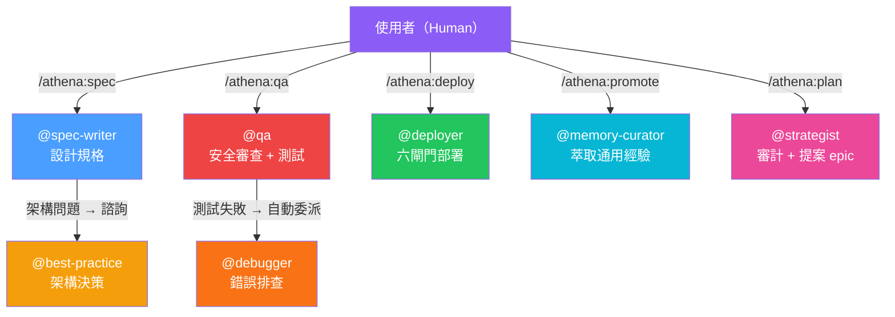
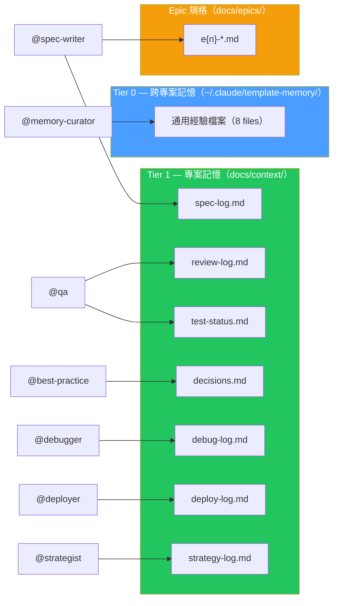

# Agent 協作圖

> 本專案有 9 個 Agent，各司其職。以下圖表呈現觸發方式、互動關係與寫入目標。

---

## Agent 觸發與互動

## Agent 寫入目標

## Agent 一覽

| Agent | 觸發方式 | 職責 | 寫入目標 |
|-------|----------|------|----------|
| @spec-writer | `/athena:spec` | 設計功能規格與 OpenAPI 契約 | `docs/epics/e{n}-*.md`、`spec-log.md` |
| @qa | `/athena:qa`、自動 | 安全審查 + 測試套件 + 80% 閘門 | `review-log.md`、`test-status.md` |
| @best-practice | 自動（架構問題時） | 架構決策與取捨分析 | `decisions.md` |
| @debugger | 自動（測試失敗時） | 錯誤排查與修復 | `debug-log.md` |
| @deployer | `/athena:deploy` | 六閘門部署至 Zeabur | `deploy-log.md` |
| @memory-curator | `/athena:promote` | 萃取可通用經驗至 Tier 0 | `~/.claude/template-memory/` |
| @strategist | `/athena:plan` | 審計、研究、提案新 epic（需人工確認） | `strategy-log.md` |

## 設計哲學

- **專責分工** — 每個 agent 只負責一個領域，避免職責混淆
- **人工閘門** — @strategist 的提案需要使用者確認才會執行
- **自動委派** — 測試失敗時自動交給 @debugger，無需手動介入
- **雙層記憶** — Tier 1 記錄專案狀態，Tier 0 萃取跨專案的通用經驗

## 如何新增自訂 Agent

1. 在 `.claude/agents/` 建立新的 `.md` 檔案（YAML frontmatter + 指令）
2. 在 CLAUDE.md 的 Agent Team 區塊登記
3. 在 `docs/context/` 建立對應的寫入目標文件
