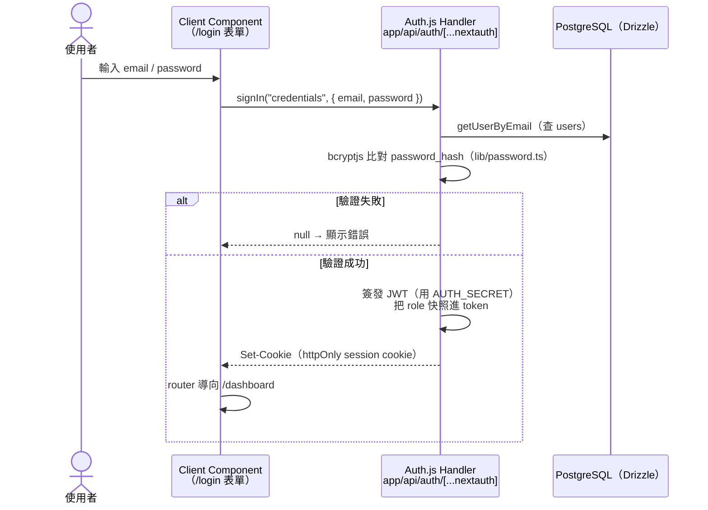
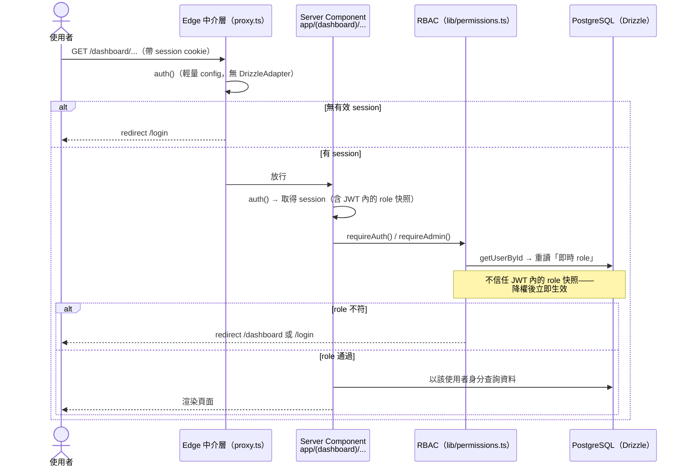
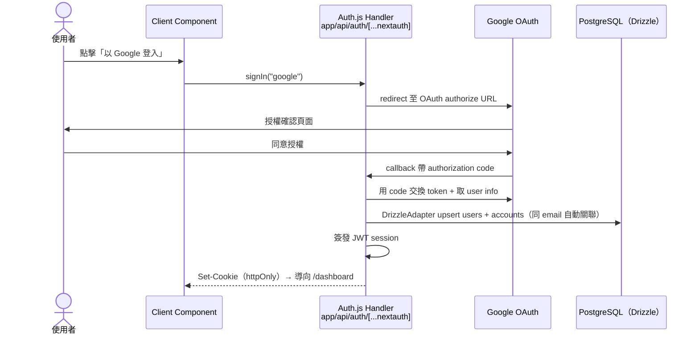

# 認證流程圖

> 本專案的認證系統基於 Auth.js v5（next-auth）+ **JWT session**。
> 以下三張時序圖涵蓋登入、受保護路由的存取，以及 OAuth 登入流程。

---

## 流程 A：登入（Credentials + JWT session）

## 流程 B：存取受保護路由 + RBAC

## 流程 C：OAuth 登入（Google）

## 安全設計說明

### 為什麼採 JWT session 而非 DB session？

- Auth.js v5 的 **Credentials provider 需要 JWT session**——DrizzleAdapter 預設的
  DB session 在 Credentials 流程下不適用。
- `sessions` 等 adapter 資料表仍保留，供 OAuth 帳號關聯使用。
- session 存於 **httpOnly cookie**，JavaScript 讀不到，從結構上防 XSS 竊取——
  不需要把 token 存進任何前端 store。

### RBAC 為何要從 DB 重讀 role？

- role 在登入當下被「快照」進 JWT；若直接信任 JWT，降權要等使用者重新登入才生效。
- `lib/permissions.ts` 的 `requireAuth` / `requireAdmin` 每次都用 `getUserById`
  重讀**即時 role**——`setUserRole` 後下一個 request 立即生效。
- `lib/is-admin.ts` 提供 client-safe 的 `isAdmin` / `canEdit` 純布林，只用於
  條件式顯示 UI，**不可**當作安全邊界（Server Action 會再檢查一次）。

### AUTH_SECRET 的意義

- JWT session 用 `AUTH_SECRET` 簽章；缺少或輪替 `AUTH_SECRET` 會讓所有既有 session
  失效並導致登入失敗。設定一次後保持穩定。
