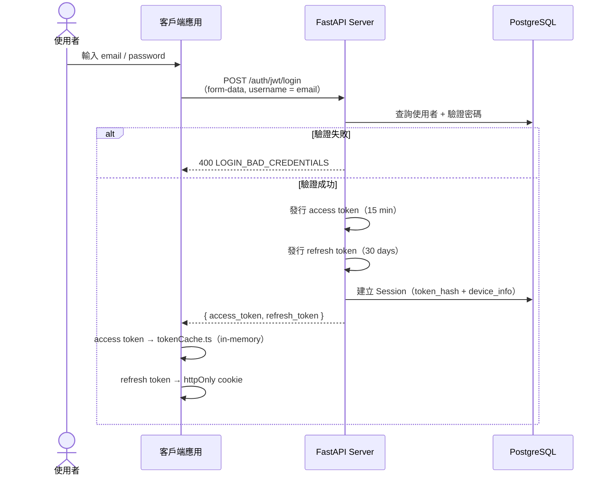
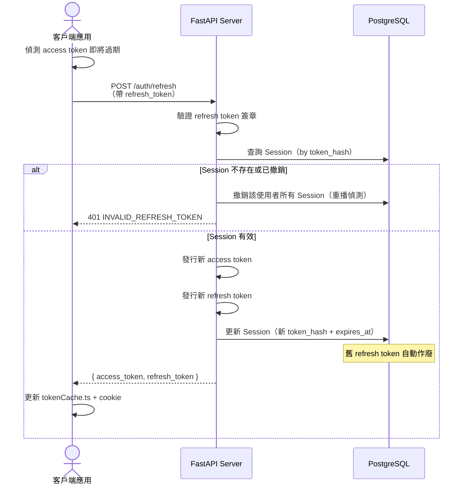
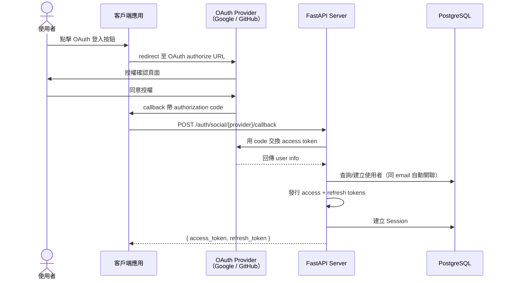

# 認證流程圖

> 本專案的認證系統基於 JWT + Refresh Token 輪替機制。
> 以下三張時序圖涵蓋登入、token 刷新與 OAuth 登入流程。

---

## 流程 A：登入 + Token 發行

## 流程 B：Token 刷新（Refresh Rotation）

## 流程 C：OAuth 登入（Google / GitHub）

## 安全設計說明

### 為什麼 access token 不存 localStorage？

- **XSS 防護** — localStorage 可被任何注入的 JavaScript 讀取
- `tokenCache.ts` 使用 in-memory 變數，頁面重整後 token 消失
- 配合 refresh token 的 httpOnly cookie，重新取得 access token

### Refresh Token 輪替的意義

- **單次使用** — 每次 refresh 都會發行新的 refresh token，舊的立即作廢
- **洩漏偵測** — 如果已撤銷的 token 被重複使用，server 會撤銷該使用者的所有 session
- **伺服端追蹤** — Session 表記錄 `token_hash`、`device_info`、`ip_address`

### OAuth 帳號合併

- 如果 OAuth provider 回傳的 email 與現有帳號相同，會自動關聯（不建立新帳號）
- 使用 `fastapi-users` 的 `SQLAlchemyBaseOAuthAccountTableUUID` 管理 OAuth 關係
