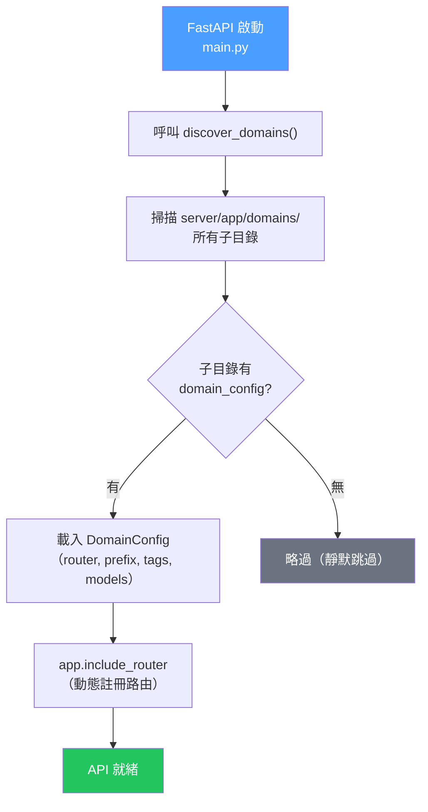
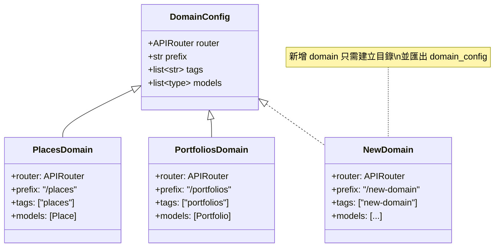
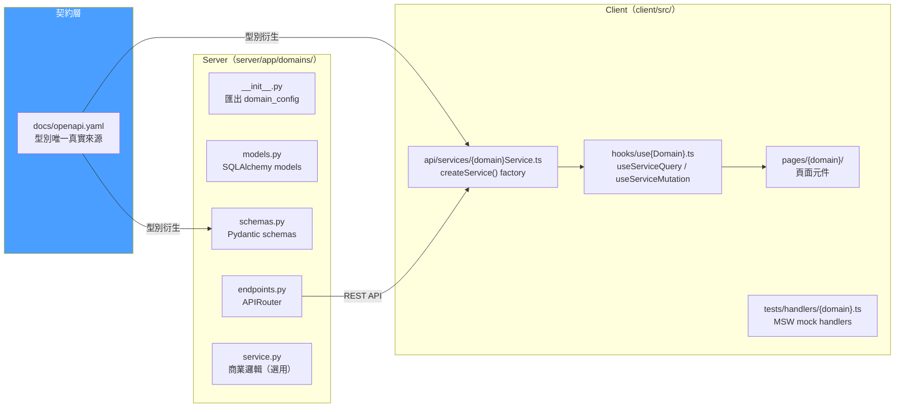

# Domain 結構圖

> E22 引入的 Domain Registry 插件機制，讓新增/移除 domain 不需修改 `main.py`。
> 以下圖表說明自動發現流程、套件結構與 Client 對應關係。

---

## 圖 A：Domain Registry 運作流程



> **零斷裂刪除（Zero-Import Deletion）**：刪除一個 domain 目錄不會造成任何 import 錯誤，
> `discover_domains()` 下次啟動時自動忽略不存在的目錄。

## 圖 B：DomainConfig 介面



## 圖 C：Server + Client 對稱結構



## Domain 套件結構

```
server/app/domains/
├── __init__.py              → DomainConfig dataclass + discover_domains()
├── places/
│   ├── __init__.py          → 匯出 domain_config
│   ├── models.py            → Place SQLAlchemy model
│   ├── schemas.py           → PlaceCreate / PlaceRead / PlaceUpdate
│   ├── endpoints.py         → APIRouter（CRUD 端點）
│   └── service.py           → 商業邏輯（選用）
├── portfolios/
│   └── ...（同樣結構）
└── {new-domain}/
    └── ...（同樣結構）
```

## 設計理念

1. **零斷裂刪除** — 刪除 domain 目錄不會造成任何 import 錯誤
2. **慣例優於配置** — 只要匯出 `domain_config`，即可自動註冊
3. **Server-Client 對稱** — 每個 domain 在 server 和 client 有對應的檔案結構
4. **OpenAPI 為橋樑** — `docs/openapi.yaml` 是 server schemas 和 client services 的共同來源

## 如何新增 Domain

1. 在 `server/app/domains/` 建立新子目錄
2. 建立 `models.py`、`schemas.py`、`endpoints.py`
3. 在 `__init__.py` 匯出 `domain_config = DomainConfig(...)`
4. 在 `client/src/` 建立對應的 service、hook、page、test handler
5. 重啟 server — `discover_domains()` 會自動發現並註冊

> 詳見 E23 `/athena:domain` 指令可自動化此流程。
