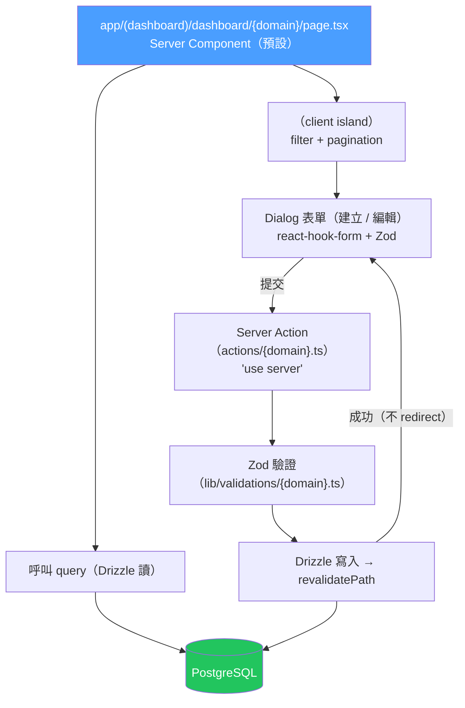
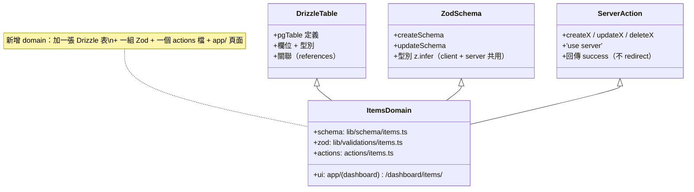
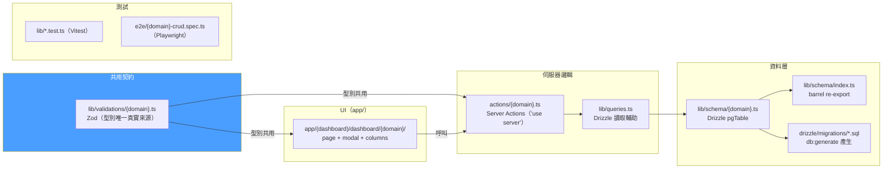

# Domain 結構圖

> 在這個 Next.js 單一應用裡，一個「domain」不是外掛註冊機制，而是一組約定俗成的檔案：
> Drizzle schema + Server Actions + `app/` 路由 + 共用 Zod。新增/移除 domain 只是
> 加減這些檔案，不需要改任何中央註冊表。`items` 是參考實作。

---

## 圖 A：一個 Request 在 domain 內的流向



> **CRUD 用 modal、不用頁面跳轉（E273）**：Server Action 成功時**回傳成功（不 `redirect`）**，
> modal 關閉後靠 `revalidatePath` + `router.refresh()` 重新整理清單。

## 圖 B：一個 domain 的資料形狀（Drizzle + Zod）



## 圖 C：一個 domain 橫跨的檔案



## Domain 檔案結構

```
next-app/
├── lib/schema/{domain}.ts          → Drizzle pgTable（再由 index.ts barrel 匯出）
├── lib/validations/{domain}.ts     → Zod schema（client + server 共用型別）
├── actions/{domain}.ts             → Server Actions（'use server'，CRUD 變更）
├── app/(dashboard)/dashboard/{domain}/
│   ├── page.tsx                    → Server Component（讀資料 + <DataTable>）
│   ├── columns.tsx                 → DataTable 欄位定義（client）
│   └── *-dialog.tsx                → 建立 / 編輯 modal（client）
└── drizzle/migrations/*.sql        → db:generate 後 db:migrate 套用
```

## 設計理念

1. **慣例優於配置** — domain 就是一組固定位置的檔案，沒有中央註冊表要維護
2. **Server-first** — 讀資料用 Server Component 直連 Drizzle；變更走 Server Action
3. **Zod 為橋樑** — `lib/validations/{domain}.ts` 是 client 表單與 server 驗證的共同型別來源
4. **CRUD 用 modal** — 參考實作 `app/(dashboard)/dashboard/items/`（E273）

## 如何新增 Domain

1. 在 `lib/schema/{domain}.ts` 定義 Drizzle 表，並在 `lib/schema/index.ts` 匯出
2. 跑 `pnpm db:generate` 產生 SQL migration，再 `pnpm db:migrate` 套用
3. 在 `lib/validations/{domain}.ts` 定義 Zod schema
4. 在 `actions/{domain}.ts` 寫 Server Actions（建立 / 編輯 / 刪除，回傳 success）
5. 在 `app/(dashboard)/dashboard/{domain}/` 建立頁面、`<DataTable>` 與 modal
6. 加上 Vitest 單元測試與 Playwright e2e

> 詳見 `/athena:domain` 指令可自動化大部分樣板。
