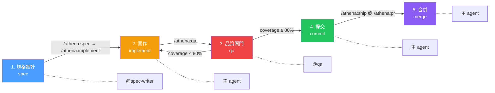
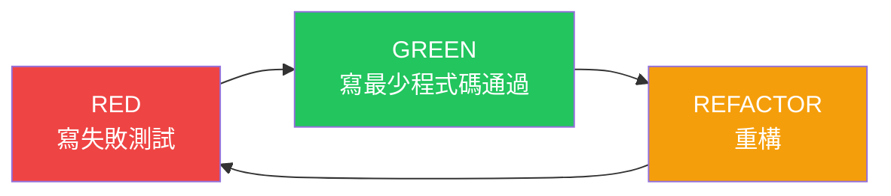
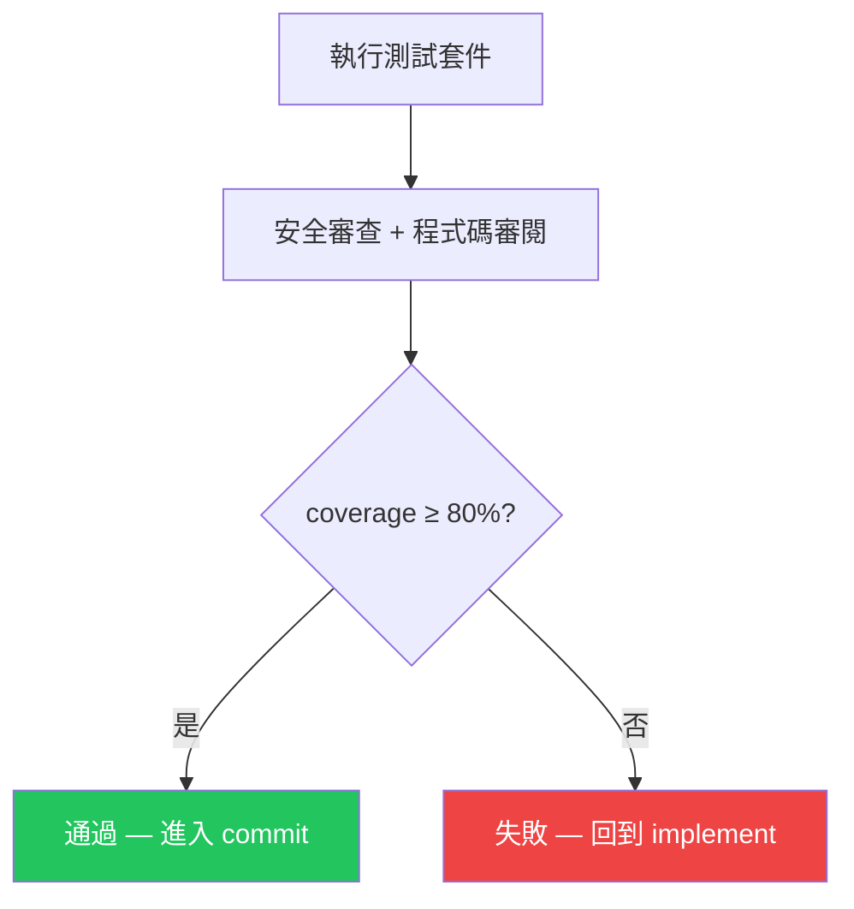

# Epic 開發流程圖

> 本專案採用 Epic 驅動開發，每個功能嚴格遵循五步驟流水線。
> 使用 `/athena:loop` 指令每次推進一步。

---

## 主流程

## SDD 子流程（在 spec 步驟內）

> **SDD（Spec-Driven Development）**：永遠先編輯 `docs/openapi.yaml`，再撰寫 server/client 程式碼。
> OpenAPI 為所有型別的唯一真實來源（Single Source of Truth）。

## TDD 子流程（在 implement 步驟內）

## QA 閘門邏輯

## Phase 邊界

當一個 Phase 內所有 Epic 完成時，流程會暫停並回報：

- 總結已完成的 Epic 清單
- 更新 `docs/epics/EPIC_INDEX.md` 狀態
- 等待人工確認後才進入下一個 Phase

## 流程大原則

1. **一次推進一步** — `/athena:loop` 每次只執行一個步驟
2. **永不跳過 QA** — coverage 低於 80% 會被閘門擋住
3. **失敗時回退** — QA 不通過則回到 implement 步驟修復
4. **Phase 邊界暫停** — 所有 epic 完成才進入下一階段
