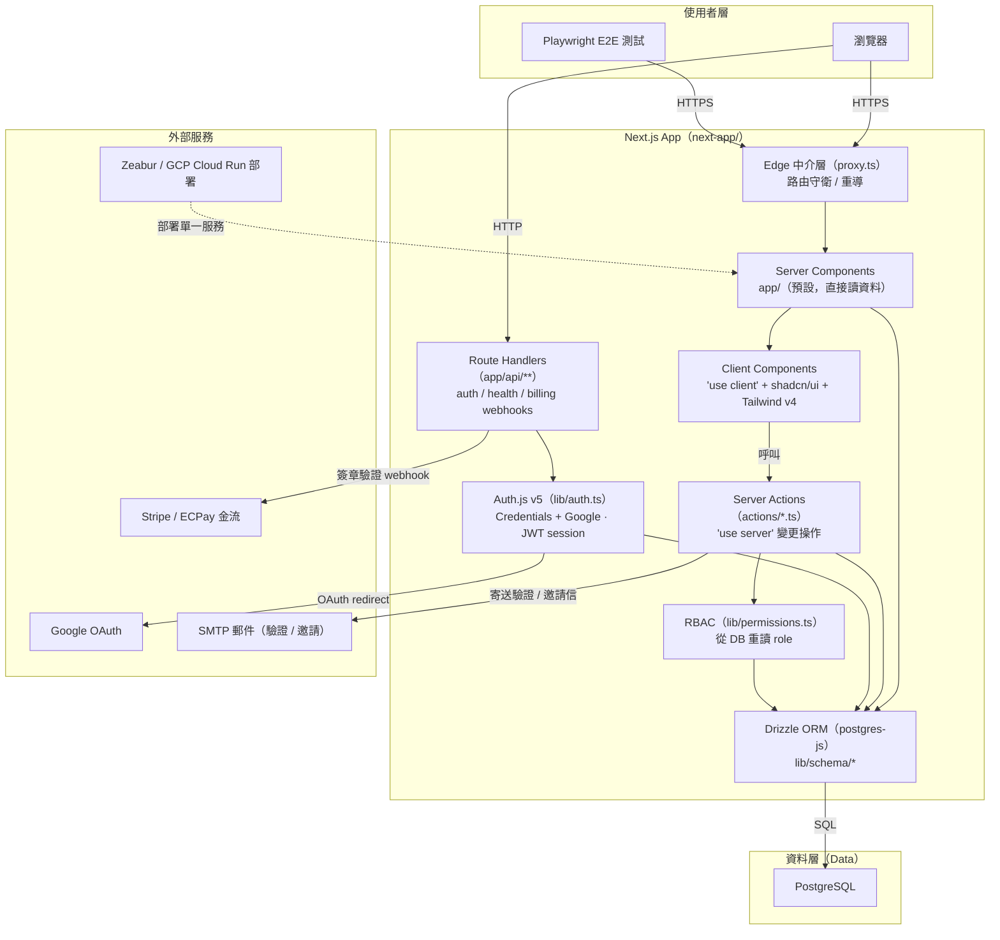

# 系統架構圖

> 單一 Next.js App + 資料層 + 外部服務的全貌圖。適合新使用者快速理解系統組成。
> 沒有獨立的 server/client 拆分——整個應用就是 `next-app/` 這一個 Next.js 服務。

---

## 各層職責

| 層級 | 說明 |
|------|------|
| **使用者層** | 瀏覽器或 E2E 測試透過 HTTPS 存取 Next.js App |
| **應用層** | 單一 Next.js App：Server Components 預設負責讀資料與渲染；Client Components 只在需要瀏覽器能力時用 `'use client'`；Server Actions 處理變更；Route Handlers 提供少數 HTTP 端點；Auth.js + RBAC 處理認證授權 |
| **資料層** | PostgreSQL 為核心資料庫，透過 Drizzle ORM（postgres-js）存取 |
| **外部服務** | Zeabur / GCP Cloud Run 部署、Google OAuth、SMTP 郵件、Stripe/ECPay 金流 |

## 關鍵連線說明

- **Browser to App** — 先經 Edge 中介層 `proxy.ts` 做路由守衛，再進入 App Router
- **讀資料** — Server Components 直接透過 Drizzle 查 PostgreSQL，無 HTTP 來回
- **變更操作** — Client 直接呼叫 Server Action（`'use server'`），驗證 Zod 後寫 Drizzle，再 `revalidatePath`
- **認證** — Auth.js v5（Credentials + Google）採 **JWT session**；RBAC（`lib/permissions.ts`）從 DB 重讀 role
- **HTTP 端點** — 只有 Auth.js callback、health、billing webhook 需要 Route Handler
