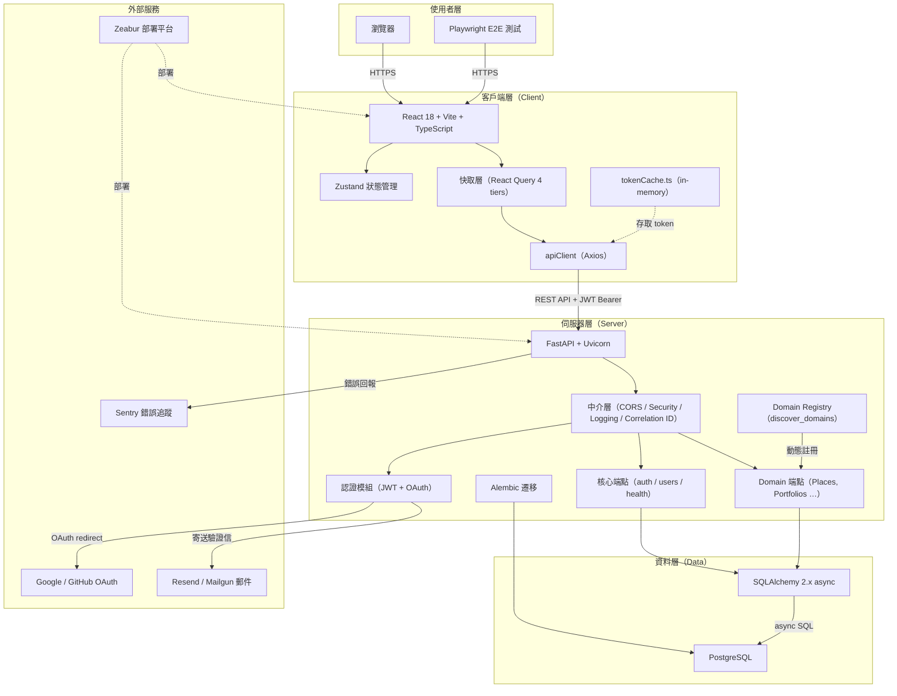

# 系統架構圖

> 四層架構 + 外部服務的全貌圖。適合新使用者快速理解系統組成。

---

## 各層職責

| 層級 | 說明 |
|------|------|
| **使用者層** | 瀏覽器或 E2E 測試透過 HTTPS 存取客戶端 |
| **客戶端層** | React SPA 負責 UI 渲染、狀態管理、快取策略與 token 儲存 |
| **伺服器層** | FastAPI 處理 REST API、認證、domain 路由註冊與中介層 |
| **資料層** | PostgreSQL 為核心資料庫，透過 SQLAlchemy async ORM 存取 |
| **外部服務** | Zeabur 部署、Google/GitHub OAuth、郵件服務、Sentry 監控 |

## 關鍵連線說明

- **Client to Server** — REST API + JWT Bearer token 認證
- **Server to DB** — async SQLAlchemy，非同步連線池
- **Token 儲存** — Access token 僅存於 `tokenCache.ts` in-memory（防 XSS）
- **Domain 註冊** — `discover_domains()` 啟動時自動掃描 `server/app/domains/` 子目錄
