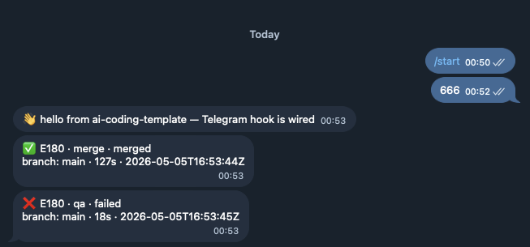

# Telegram 通知設定教學

> 把 epic 開發進度（merge / deploy / failed / blocked …）即時推送到你的 Telegram。
> 本教學完整走過：建立 bot → 取得 chat_id → 設定本地環境變數 → 三段式驗證。
> 約 5 分鐘完成。

---

## 為什麼要設定通知？

Claude Code 的 `task-completed.sh` hook 會在每個 epic 階段完成時觸發。預設它**靜默退出**（沒設定 webhook URL 就不發）。設定後，只在「我需要立刻看一眼」的關鍵節點才推播 — 這是 `NOTIFY_LEVEL=boundaries`（預設）的設計：避免每個 subagent dispatch 都響一次，一週後你就會無視這個 channel。

**會推播的事件**：
- `step` 是 `merge` / `deploy` / `start`
- 或 `status` 是 `failed` / `blocked` / `needs_human` / `merged`

**不會推播的事件**（除非設 `NOTIFY_LEVEL=verbose`）：
- 每個子 agent 的 `implement` / `qa` / `commit` 完成

---

## 前置需求

- 一個 Telegram 帳號（手機或桌面都行）
- 終端機能執行 `curl` 與 `jq`（macOS 內建 curl，`brew install jq` 補 jq）
- 本 repo 的 hook 框架已存在（`scripts/hooks/task-completed.sh`，PR #155 已合併）

---

## Step 1 — 建立 Telegram Bot

1. 在 Telegram 搜尋 **@BotFather** 並開啟對話
2. 傳送 `/newbot`
3. 依提示輸入：
   - **bot name**（顯示名稱，可中文）
   - **bot username**（必須以 `_bot` 結尾，例如 `agentic_coding_notification_bot`）
4. BotFather 會回傳一段 token，格式像：

   ```
   7972857229:AAEbx-SjovUENgHuWVI2VtHwbEFUPUNO5po
   ```

   ⚠️ **這個 token 等同密碼** — 任何拿到它的人都能以你的 bot 名義發訊息。**不要 commit 進 git，不要貼到公開頻道。**

---

## Step 2 — 與 Bot 開始對話

Bot 不能主動找你 — Telegram 規定你要先傳訊息給它，bot 才能取得你的 `chat_id`。

1. 在 Telegram 搜尋你剛建立的 bot username
2. 點 **START**（或傳送 `/start`）
3. 隨便再傳一句話（例如 `hi`），確保 bot 收到至少一則訊息

---

## Step 3 — 取得你的 chat_id

把下列指令的 `<TOKEN>` 換成 Step 1 的 token：

```bash
curl -s "https://api.telegram.org/bot<TOKEN>/getUpdates" | jq '.result | map({chat_id: .message.chat.id, from: .message.from.username, text: .message.text})'
```

預期輸出：

```json
[
  {
    "chat_id": 7170313073,
    "from": "alexhsieh666",
    "text": "/start"
  }
]
```

記下 `chat_id`（純數字）。

> **如果回傳 `[]`：**
> - 你還沒按 START 或還沒傳訊息
> - 或 bot 已被設 webhook（執行 `curl ".../bot<TOKEN>/getWebhookInfo"` 確認；若有 `url`，跑 `curl ".../bot<TOKEN>/deleteWebhook"`）

---

## Step 4 — 設定本地環境變數

把 token 與 chat_id 寫進 `.claude/settings.local.json`。**這個檔案被全域 gitignore 涵蓋（`**/.claude/settings.local.json`），不會被 commit。**

編輯 `.claude/settings.local.json`（如果還沒有就新增）：

```json
{
  "permissions": {
    "allow": []
  },
  "env": {
    "AI_CODING_WEBHOOK_URL": "https://api.telegram.org/bot<TOKEN>/sendMessage",
    "TELEGRAM_CHAT_ID": "<CHAT_ID>",
    "NOTIFY_LEVEL": "boundaries"
  }
}
```

把 `<TOKEN>` 與 `<CHAT_ID>` 換成你的值。

> **為什麼放在 `settings.local.json` 而不是 `settings.json`？**
> `settings.json` 會 commit，token 會洩漏。`settings.local.json` 是 Claude Code 的個人覆蓋檔，永遠 gitignored。

> **驗證 gitignore：**
> ```bash
> git check-ignore -v .claude/settings.local.json
> # 預期輸出：~/.config/git/ignore:1:**/.claude/settings.local.json
> ```

---

## Step 5 — 三段式驗證

### 驗證 A：直接打 Telegram API（確認 token + chat_id 對）

```bash
curl -s -X POST "https://api.telegram.org/bot<TOKEN>/sendMessage" \
  -H "Content-Type: application/json" \
  -d '{"chat_id":"<CHAT_ID>","text":"👋 hello from ai-coding-template"}' \
  | jq '{ok, message_id: .result.message_id}'
```

預期：
```json
{ "ok": true, "message_id": 1 }
```
你的 Telegram 應該立刻收到 `👋 hello from ai-coding-template`。

### 驗證 B：dry-run hook（看 payload 長相，不真送）

```bash
echo '{"epic_id":"E180","step":"merge","status":"merged","duration_seconds":127}' | \
  AI_CODING_WEBHOOK_URL="https://api.telegram.org/bot<TOKEN>/sendMessage" \
  TELEGRAM_CHAT_ID="<CHAT_ID>" \
  NOTIFY_DRY_RUN=1 \
  bash scripts/hooks/task-completed.sh
```

預期輸出（不會真的送出）：
```json
{
  "chat_id": "<CHAT_ID>",
  "text": "✅ E180 · merge · merged\nbranch: main · 127s · 2026-05-06T...",
  "parse_mode": "Markdown"
}
```

### 驗證 C：完整 hook 真送（確認端到端）

```bash
# 邊界事件 — 應該收到
echo '{"epic_id":"E180","step":"merge","status":"merged","duration_seconds":127}' | \
  AI_CODING_WEBHOOK_URL="https://api.telegram.org/bot<TOKEN>/sendMessage" \
  TELEGRAM_CHAT_ID="<CHAT_ID>" \
  bash scripts/hooks/task-completed.sh
```

預期 Telegram 收到：`✅ E180 · merge · merged\nbranch: main · 127s · ...`

```bash
# 非邊界事件 — 不應該收到（驗證 NOTIFY_LEVEL=boundaries 過濾正確）
echo '{"epic_id":"E180","step":"implement","status":"completed","duration_seconds":42}' | \
  AI_CODING_WEBHOOK_URL="https://api.telegram.org/bot<TOKEN>/sendMessage" \
  TELEGRAM_CHAT_ID="<CHAT_ID>" \
  bash scripts/hooks/task-completed.sh
```

預期 Telegram **不會**收到任何訊息（hook 安靜退出）。

```bash
# 失敗事件 — 應該收到（boundary 是 status 而非 step）
echo '{"epic_id":"E180","step":"qa","status":"failed","duration_seconds":18}' | \
  AI_CODING_WEBHOOK_URL="https://api.telegram.org/bot<TOKEN>/sendMessage" \
  TELEGRAM_CHAT_ID="<CHAT_ID>" \
  bash scripts/hooks/task-completed.sh
```

預期 Telegram 收到：`❌ E180 · qa · failed\nbranch: main · 18s · ...`

### 驗證成功的樣子

完成驗證 A + C 後，Telegram 對話應該長這樣（`/start` 與 `666` 是 Step 2 你傳給 bot 的訊息）：



三則訊息一次到齊：
- 👋 `hello from ai-coding-template — Telegram hook is wired`（驗證 A 直送）
- ✅ `E180 · merge · merged` + branch/duration 註腳（驗證 C 邊界事件）
- ❌ `E180 · qa · failed` + branch/duration 註腳（驗證 C 失敗事件）

如果你的版面是這樣，整條 hook → adapter → Telegram 通路就完整通了。

---

## NOTIFY_LEVEL 三檔對照

| `NOTIFY_LEVEL` | 觸發時機 | 適合誰 |
|---|---|---|
| `silent` | 永不送 | 暫時靜音、不想拆掉設定 |
| `boundaries`（預設） | `step` ∈ {merge, deploy, start} **或** `status` ∈ {failed, blocked, needs_human, merged} | 想看完成 / 失敗、不想被淹沒 |
| `verbose` | 每個 `TaskCompleted` 都送 | 短期 debug / 觀察 agent 行為 |

要切換等級，改 `.claude/settings.local.json` 的 `env.NOTIFY_LEVEL` 值即可。

---

## 故障排除

| 症狀 | 原因 | 修復 |
|---|---|---|
| `getUpdates` 回 `[]` | 沒按 START / 沒傳訊息給 bot | 開啟 bot 對話、按 START |
| `getUpdates` 回 `[]`（已傳訊息） | bot 設了 webhook 攔截 updates | `curl ".../deleteWebhook"` |
| 收到 `{"ok":false,"error_code":401}` | token 錯 / 已被 revoke | 回 BotFather `/token` 重新產 |
| 收到 `{"ok":false,"error_code":400,"description":"Bad Request: chat not found"}` | chat_id 錯 | 重做 Step 3，注意是純數字 |
| hook 跑了沒錯誤但 Telegram 沒收到 | 事件被 `boundaries` 過濾 | 用驗證 B 的 dry-run 確認、或暫時改 `verbose` |
| token 不小心 commit 進 git | 該 token 已洩漏 | 立刻去 BotFather `/revoke` 並產新 token |

---

## 安全注意事項

- **永遠不要把 token commit 進 git。** `.claude/settings.local.json` 是唯一安全的地方（已被全域 gitignore 涵蓋）。
- **token 洩漏的處置**：BotFather → `/revoke` → 選 bot → 產生新 token → 更新 `settings.local.json`。
- **bot 不需要的話可刪除**：BotFather → `/deletebot` → 選 bot → 確認。
- **不要把 chat_id 視為密碼** — 但也別公開貼，避免他人若拿到你的 token 後能直送你的私訊。

---

## 進階：把通知改送到 Slack 或 Discord

`task-completed.sh` 的 adapter pattern 從 URL host 自動偵測目標 — 改 URL 即可，不需要改 code。

```bash
# Slack — 把 webhook URL 換上即可，TELEGRAM_CHAT_ID 不需要
"AI_CODING_WEBHOOK_URL": "https://hooks.slack.com/services/T.../B.../..."

# Discord — 同理
"AI_CODING_WEBHOOK_URL": "https://discord.com/api/webhooks/.../..."

# 任何其他 URL — 走通用 JSON（適合 n8n / Zapier / 自架 server）
"AI_CODING_WEBHOOK_URL": "https://your.server/webhook"
```

每種 adapter 的 payload 格式詳見 `scripts/hooks/CLAUDE.md` 的「Webhook Payload」章節。

---

## 相關檔案

- `scripts/hooks/task-completed.sh` — hook 本體
- `scripts/hooks/tests/test-task-completed.sh` — 12 個 fixture 測試（用 `NOTIFY_DRY_RUN=1`）
- `scripts/hooks/CLAUDE.md` — hook 完整註冊表 + 環境變數對照
- `docs/guides/zh-TW/ai-agent-team-guide.md` § Webhook 通知 — 摘要版
